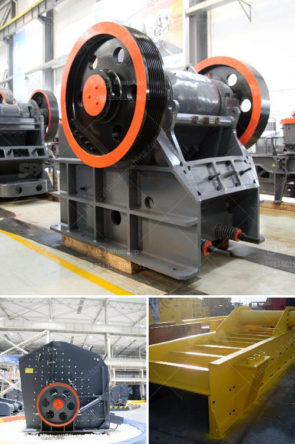

<h3>dolomite grinding machine</h3>
Dolomite is a carbonate mineral, widely used in various industries. Dolomite powder is an important raw material in the production of float glass, fiberglass, optical glass, and ceramics. It is also used as a fluxing agent in metallurgy and chemical industries. What makes dolomite even more valuable is its extensive use as an agricultural soil conditioner to neutralize acidity and provide essential nutrients to plants.

To process dolomite, the dolomite grinding machine is necessary. Dolomite grinding machine includes various types, such as ball mill, Raymond mill, trapezium mill, high pressure grinding mill, and ultrafine grinding mill. These machines can grind dolomite into different fineness, depending on the application.

The dolomite grinding machine is an ideal grinding equipment for dolomite processing. Dolomite can be used in building materials, ceramics, glass and refractory materials, chemical industry and agriculture, environmental protection, energy saving and other fields. It is mainly used as a fluxing agent and refractory material in the metallurgical industry, and as a raw material for the production of glass and ceramics.

The dolomite grinding machine has the advantages of high production efficiency, environmental protection, energy saving, and low noise. It integrates crushing, drying, grinding, grading, and conveying. It can be used in the grinding and processing of more than 280 kinds of materials, such as barite, calcite, feldspar, talc, marble, limestone, dolomite, fluorite, lime, activated clay, activated carbon, bentonite, kaolin, cement, phosphate rock, gypsum, glass, insulation materials, etc.

In conclusion, the dolomite grinding machine is an ideal grinding equipment that combines crushing, drying, grinding, grading, and conveying. It can grind dolomite into different fineness, suitable for various industries. With advanced technology, high production efficiency, and environmental protection features, it is widely used and favored in the market.
<h3>Contact us</h3><ul><li><strong>Whatsapp:&nbsp;<a href="https://wa.me/8613661969651">+8613661969651</a></strong></li><li><a href="https://swt.shibang-china.com/?git&amp;zhl&amp;dolomite grinding machine"><strong>Online Service(chat now)</strong></a></li></ul><h3>Related</h3><ul><li><a href='jaw crushers zimbabwe.md'>jaw crushers zimbabwe</a></li><li><a href='lime stone crusher with capacity.md'>lime stone crusher with capacity</a></li><li><a href='used mobile crusher pakistan.md'>used mobile crusher pakistan</a></li><li><a href='hammer mills produced in brazil.md'>hammer mills produced in brazil</a></li><li><a href='old used coal washing plants.md'>old used coal washing plants</a></li></ul>