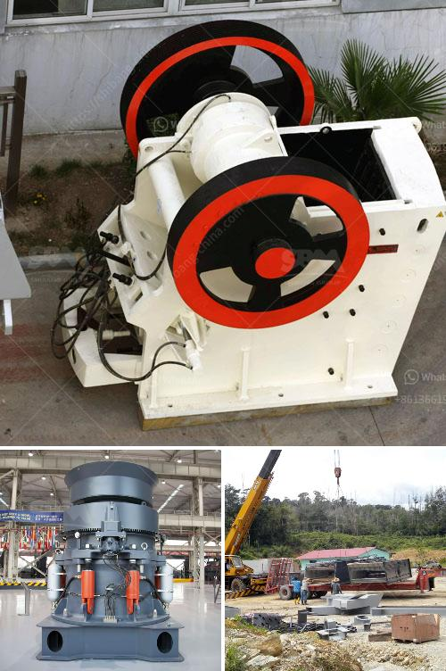

<h3>dolomite powder machine</h3>
Dolomite is a mineral that is commonly found in sedimentary rocks. It is a calcium magnesium carbonate with a chemical formula of CaMg(CO3)2. Dolomite powder is widely used in various industries such as construction, agriculture, ceramics, chemical, and metallurgy due to its distinct properties and versatility.

One of the significant applications of dolomite powder is in the construction industry. It is used as an aggregate in concrete to enhance its durability and strength. The addition of dolomite powder reduces the water-cement ratio, resulting in a denser concrete structure. Moreover, the micro-filling effect of dolomite powder increases the workability of concrete, making it easier to pour and shape. Additionally, dolomite powder is also used as a filler in asphalt and other construction materials, providing better resistance to wear and tear.

Agriculture is another industry that benefits greatly from dolomite powder. Due to its neutralizing properties, dolomite powder is used as a soil conditioner to improve soil fertility. It helps to balance the pH level of acidic soils and provide essential nutrients like calcium and magnesium to plants. Dolomite powder can also enhance water retention in sandy soils, preventing the nutrient leaching process. Farmers and gardeners can apply dolomite powder directly to the soil or mix it with fertilizers to promote healthy plant growth.

In the ceramics industry, dolomite powder is widely used in the production of tiles, pottery, and porcelain. Its low iron content makes it an ideal raw material for white and colored ceramics. Dolomite powder acts as a fluxing agent during the firing process, reducing the melting point of the ceramic material and promoting better sintering. This results in improved hardness, strength, and resistance to thermal shock. Additionally, dolomite powder is used as a filler in ceramic glazes, providing a smooth and glossy finish.

The chemical industry also utilizes dolomite powder for various applications. It is used as a source of magnesium in the production of magnesium chemicals, which are essential for manufacturing refractory bricks, fertilizers, and pharmaceuticals. Dolomite powder is also employed in the manufacturing of glass and detergents, where it acts as a flux and pH regulator. Additionally, dolomite powder is used as a catalyst in several chemical reactions due to its high heat and pressure resistance.

Metallurgical applications of dolomite powder are also significant. It is used as a refractory material in the production of steel and iron. Dolomite powder is added to the furnace during steelmaking to remove impurities and improve the properties of the final product. It acts as a flux, binding impurities like sulfur and phosphorus, preventing their entry into the final steel product. Dolomite powder also enhances the stability and thermal shock resistance of refractory materials used in furnaces and kilns.

To meet the growing demand for dolomite powder, various machines have been developed to efficiently process and produce high-quality dolomite powder. Dolomite powder machines include crushers, mills, vibrating screens, and conveyor belts, among others. These machines work together to process dolomite powder and ensure its consistent particle size and purity.

In conclusion, dolomite powder is a versatile mineral widely used in multiple industries. Its unique properties make it an essential raw material in construction, agriculture, ceramics, chemical, and metallurgy. The availability of dolomite powder machines has facilitated its processing and production, ensuring its high quality and meeting the diverse requirements of different industries. As the demand for dolomite powder continues to grow, these machines will play a crucial role in meeting the needs of various sectors and contributing to their growth and development.
<h3>Contact us</h3><ul><li><strong>Whatsapp:&nbsp;<a href="https://wa.me/8613661969651">+8613661969651</a></strong></li><li><a href="https://swt.shibang-china.com/?git&amp;zhl&amp;dolomite powder machine"><strong>Online Service(chat now)</strong></a></li></ul><h3>Related</h3><ul><li><a href='gold washing machine.md'>gold washing machine</a></li><li><a href='copper ore processing.md'>copper ore processing</a></li><li><a href='wet ball mills manufacturers.md'>wet ball mills manufacturers</a></li><li><a href='aggregate crusher production.md'>aggregate crusher production</a></li><li><a href='powder grinding mill.md'>powder grinding mill</a></li></ul>