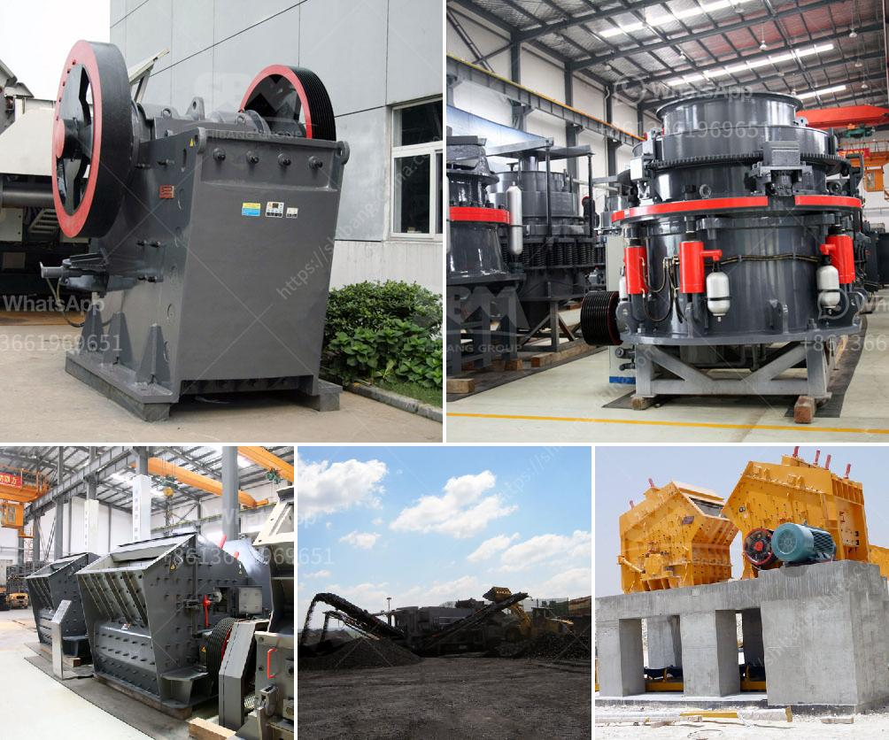

<h3>dolomite processing equipment</h3>
Dolomite is a carbonate mineral composed of calcium magnesium carbonate CaMg(CO3)2. The term is also used to describe the sedimentary carbonate rock dolostone. The dolomite can be used in building materials, porcelain, glass and refractory after dolomite crushing. In chemical industry, agriculture, environmental protection, energy conservation, etc, the dolomite is in a great demand too and so the dolomite crusher is widely applied.

On the processing, crushing machine and grinding machine are needed, such as jaw crusher, cone crusher, mtm trapezium grinder produced by SBM, which is a professional crushing machine manufacturer and supplier in the world. It is also a good choice for dolomite processing and the fine powder size can be 40 mesh to 325 mesh for industry usage. The powder output size of dolomite mill(Raymond Mill) can be adjusted continuously according to the customers' demand.

The dolomite processing plant is used for making dolomite into powder for glass plant. "SBM supplies the right dolomite crushing equipment and grinding mills including whole solution to every method and application. It is the important equipment for grinding dolomite power, which includes the crushing, grinding, dry and wet grinding methods.

Currently, SBM dolomite mining process plant is a dedicated mineral processing, construction, roads, railways and other industries dolomite and stone production line, the entire production line in addition to Dolomite Mining Machine boot shutdown and routine maintenance, almost no manual operation, high production efficiency, low operating costs, yield, high yield, finished dolomite uniform size, grain shape is good, reasonable gradation.

The kind of equipment for dolomite processing is also increased. The dolomite ultrafine powder production line is a complex process requiring many processes, such as feeding, crushing and screening, grinding, conveying, etc. it can be divided into jaw crusher, vibrating feeder, impact crusher, vibrating screen, conveyor and other equipment.

In terms of grinding equipment, we need a dolomite grinding mill for grinding dolomite into various sizes. As a professional grinding machinery manufacturer, we can supply the dolomite grinding mill as different particle sizes and also design special solutions for the dolomite grinding project. With different types and models of grinding mills, we provide dolomite vertical roller mill, medium-speed micro powder grinding mill, Raymond mill and other equipment.

Dolomite processed by this equipment has high whiteness, strong chemical stability, and excellent weatherability. It can be used as filler and paint extender in coatings, plastics, rubber, and other industries, and can also be used in production ceramics and other industries.

In conclusion, the dolomite is widely used in building materials, ceramics, glass and refractory materials, chemical industry, agriculture, environmental protection, energy conservation, etc. So the dolomite processing equipment is becoming more and more popular. The dolomite powder can be processed by dolomite grinding mill, as well as other industrial grinding mills. In addition, dolomite processing equipment can be customized according to customers' different requirements. So it is a good investment project for dolomite processing.
<h3>Contact us</h3><ul><li><strong>Whatsapp:&nbsp;<a href="https://wa.me/8613661969651">+8613661969651</a></strong></li><li><a href="https://swt.shibang-china.com/?git&amp;zhl&amp;dolomite processing equipment"><strong>Online Service(chat now)</strong></a></li></ul><h3>Related</h3><ul><li><a href='river sand washing machine.md'>river sand washing machine</a></li><li><a href='gold crusher cost.md'>gold crusher cost</a></li><li><a href='sand dust removal.md'>sand dust removal</a></li><li><a href='stone crusher plant ton jam.md'>stone crusher plant ton jam</a></li><li><a href='conical ball mill for sale.md'>conical ball mill for sale</a></li></ul>