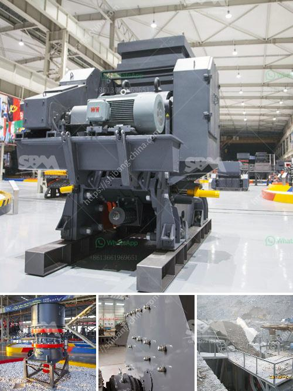

<h3>dolomite refractory bricks process</h3>
Refractory bricks are materials that are designed to withstand high temperatures and harsh conditions without deteriorating. These bricks are crucial in industries such as steel, cement, and glass manufacturing, where the use of high temperatures is common. Among the various types of refractory bricks available, dolomite refractory bricks have gained immense popularity due to their exceptional strength and durability.

Dolomite refractory bricks are primarily composed of dolomite, a mineral consisting of calcium magnesium carbonate. This natural rock is abundant and easily available, making it a cost-effective and widely used material in the production of refractory bricks. The manufacturing process of dolomite refractory bricks involves several stages, each contributing to the final product's strength and performance.

The first step in producing dolomite refractory bricks is the extraction of raw dolomite. This mineral is typically mined from quarries or underground deposits. Once the dolomite is extracted, it undergoes a series of crushing and grinding processes to obtain the desired particle size. The finely ground dolomite is then mixed with other additives, such as clay and silica, to enhance its refractory properties.

After the raw materials are thoroughly mixed, the dolomite mixture is shaped into the desired brick form using a molding process. This can be done through extrusion, where the dolomite mixture is forced through a die to form bricks of a specific shape and size. Alternatively, the mixture can be pressed into molds, creating bricks with a smooth, uniform surface.

Once the dolomite mixture is shaped, the bricks undergo a drying process. This involves gradually removing moisture from the bricks to prevent cracking or warping during firing. The drying process is typically carried out in specialized drying chambers or kilns, where the bricks are exposed to controlled temperature and humidity conditions.

The final and most critical step in the manufacturing process is firing or sintering the dolomite refractory bricks. In this step, the dried bricks are subjected to high temperatures ranging from 1500 to 1800 degrees Celsius. The intense heat causes the dolomite particles to fuse together, forming a solid, dense brick structure. This process is known as sintering, and it contributes to the exceptional strength and durability of dolomite refractory bricks.

Once the firing process is complete, the dolomite refractory bricks are carefully inspected for any defects or imperfections. Bricks that pass the quality checks are ready for shipment and installation in various industrial applications. Dolomite refractory bricks are commonly used in lining furnaces, kilns, and other high-temperature equipment, where they provide excellent resistance to thermal shock and chemical corrosion.

In conclusion, the manufacturing process of dolomite refractory bricks involves extracting raw dolomite, grinding it to the desired particle size, mixing it with additives, shaping the mixture into bricks, drying them, and firing them at high temperatures. This process ensures that the final product exhibits exceptional strength, durability, and resistance to harsh conditions. Dolomite refractory bricks are highly sought after in industries that rely on high-temperature operations, making them an indispensable material for maintaining the efficiency and productivity of various industrial processes.
<h3>Contact us</h3><ul><li><strong>Whatsapp:&nbsp;<a href="https://wa.me/8613661969651">+8613661969651</a></strong></li><li><a href="https://swt.shibang-china.com/?git&amp;zhl&amp;dolomite refractory bricks process"><strong>Online Service(chat now)</strong></a></li></ul><h3>Related</h3><ul><li><a href='the estimated cost of setting up a quarry.md'>the estimated cost of setting up a quarry</a></li><li><a href='stone quarries south africa.md'>stone quarries south africa</a></li><li><a href='crusher price in nepal.md'>crusher price in nepal</a></li><li><a href='alluvial chrome wash plant in the usa.md'>alluvial chrome wash plant in the usa</a></li><li><a href='how much is a crusher.md'>how much is a crusher</a></li></ul>