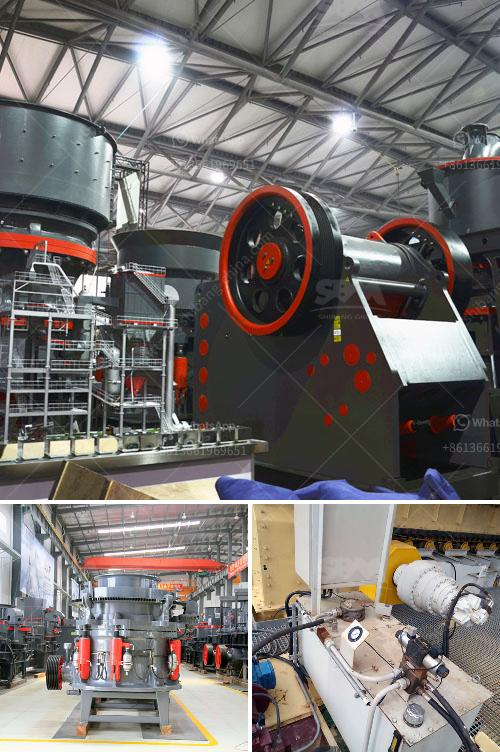

<h3>dolomite rock crusher</h3>
Dolomite is a sedimentary rock made up of calcium magnesium carbonate, which often contains small amounts of other minerals. It is widely used in various industrial applications due to its hardness and durability. In the construction industry, dolomite is crushed and used as an aggregate in concrete and asphalt mixtures, offering strength and stability to the structures.

To crush dolomite rocks into smaller pieces, heavy machinery is often required. One of the primary machines used in this process is a dolomite rock crusher. This powerful device breaks the dolomite rocks into smaller fragments that can be further processed or used for various purposes.

The dolomite rock crusher works by compressing the material between two opposing surfaces: the jaws. These jaws exert pressure on the rocks as they move closer together, reducing them in size. The crushed dolomite can be screened to separate different sizes for specific applications. The final product is used as a base material in various construction projects, such as roads, sidewalks, and foundations.

The dolomite rock crusher provides reliable performance and exceptional durability for demanding applications. Its robust design and high-quality components ensure maximum efficiency, even under harsh operating conditions. Additionally, the crusher is equipped with safety features to protect the operator and prevent any accidents.

In conclusion, the dolomite rock crusher plays a vital role in the construction industry. With its ability to crush dolomite rocks into smaller fragments, it provides the necessary materials for various construction projects. Whether it is used as a base material or in other applications, the dolomite rock crusher offers efficiency, durability, and safety to ensure smooth construction operations.
<h3>Contact us</h3><ul><li><strong>Whatsapp:&nbsp;<a href="https://wa.me/8613661969651">+8613661969651</a></strong></li><li><a href="https://swt.shibang-china.com/?git&amp;zhl&amp;dolomite rock crusher"><strong>Online Service(chat now)</strong></a></li></ul><h3>Related</h3><ul><li><a href='waived diamond mesh equipment south africa.md'>waived diamond mesh equipment south africa</a></li><li><a href='portable crushing and screening plant.md'>portable crushing and screening plant</a></li><li><a href='crusher manufacturer in saudi.md'>crusher manufacturer in saudi</a></li><li><a href='grinding machinery manufecture in ajmer.md'>grinding machinery manufecture in ajmer</a></li><li><a href='vibrating screen capacity calculation.md'>vibrating screen capacity calculation</a></li></ul>