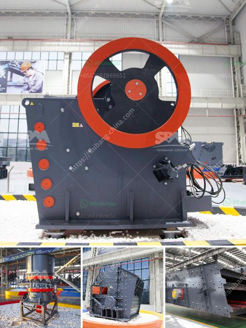

<h3>dorries vertical grinders used for sale europe</h3>
When it comes to heavy-duty machining operations, industrialists and manufacturers across Europe rely on the robust performance and unmatched quality of Dorries Vertical Grinders. These high-precision machines are designed to handle a wide array of complex grinding tasks with ease, making them an ideal choice for industries requiring efficient and reliable solutions.

Dorries Vertical Grinders are known for their unique vertical spindle orientation, which sets them apart from other conventional grinding machines. This design not only enhances productivity but also allows for precise control over the grinding process. With the spindle positioned vertically, the force exerted during grinding is distanced from the workpiece, contributing to improved stability and accuracy.

These versatile machines can be used for a multitude of applications, including grinding, milling, and honing. From automotive parts to aerospace components, Dorries Vertical Grinders prove to be immensely valuable in various industries. Their adaptability means they can handle a wide range of materials, from metals like iron and steel to non-ferrous alloys, ceramics, and composites.

As technology has advanced, so has the performance of Dorries Vertical Grinders. Modern models are equipped with state-of-the-art control systems that offer intuitive interfaces, allowing operators to program and monitor the entire grinding process effortlessly. This level of automation increases efficiency, reduces human error, and ultimately saves both time and costs.

One of the most significant advantages of investing in Dorries Vertical Grinders is their robust build quality. These machines are engineered to withstand heavy usage, ensuring long-term reliability and minimal downtime. Their durability combined with high precision makes them a cost-effective solution for demanding industrial applications.

For businesses seeking to acquire Dorries Vertical Grinders in Europe, the option of purchasing used machines offers several benefits. Buying used equipment allows for significant cost savings without compromising on quality. Furthermore, pre-owned machines often come with an extensive service history, providing peace of mind to potential buyers.

Europe boasts a thriving market for used industrial machinery, and there are numerous reputable sellers offering Dorries Vertical Grinders. These vendors typically have a vast inventory of machines, allowing customers to choose the model that best suits their specific requirements. Additionally, many sellers offer comprehensive refurbishment services, ensuring that the used machines are restored to optimal working condition before being made available for sale.

Prior to making a purchase, potential buyers must ensure that the used Dorries Vertical Grinder they are interested in meets their production needs. Factors such as spindle power, grinding capacity, and the machine's overall condition should be thoroughly evaluated. Moreover, it is advisable to partner with a reliable seller who can provide accurate product information and offer ongoing technical support after the sale.

In conclusion, Dorries Vertical Grinders signify exceptional German engineering combined with innovative features that make them a desirable option for industrial grinding solutions. The availability of used machines in Europe offers an affordable and accessible means for businesses to acquire these high-performance systems. With their robustness, precision, and versatility, Dorries Vertical Grinders are the perfect investment for manufacturers seeking reliable and efficient grinding equipment.
<h3>Contact us</h3><ul><li><strong>Whatsapp:&nbsp;<a href="https://wa.me/8613661969651">+8613661969651</a></strong></li><li><a href="https://swt.shibang-china.com/?git&amp;zhl&amp;dorries vertical grinders used for sale europe"><strong>Online Service(chat now)</strong></a></li></ul><h3>Related</h3><ul><li><a href='prices for stone crushing machine south africa.md'>prices for stone crushing machine south africa</a></li><li><a href='buy crusher of impact of 10 tph.md'>buy crusher of impact of 10 tph</a></li><li><a href='coal mining plant in ethiopia.md'>coal mining plant in ethiopia</a></li><li><a href='kaolin crusher processing machine.md'>kaolin crusher processing machine</a></li><li><a href='cheat gold crusher.md'>cheat gold crusher</a></li></ul>