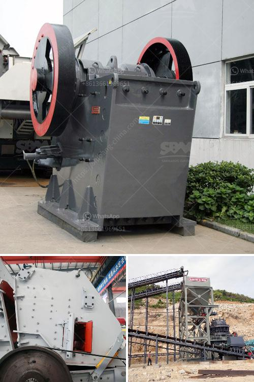

<h3>dry ball mill in lima peru</h3>
Lima, the capital of Peru, is a city thriving with economic activity. One of the key sectors contributing to its growth is the mining industry. Peru is the world's second-largest producer of copper and silver, and a major player in the production of gold, zinc, and lead. With such a significant mining industry, it is essential to have state-of-the-art equipment to meet the demands of mining operations. The dry ball mill in Lima Peru is one such equipment that plays a critical role in the extraction of minerals.

A dry ball mill is a grinding equipment used to process materials without the need for any liquid addition, enabling it to handle a wide range of materials, including cement, limestone, coal, and other minerals. The mill operates by rotating a cylinder containing grinding media, such as steel balls, causing the material to be crushed and ground into a fine powder. This finely ground material is then used in various mining processes, such as smelting and chemical refining.

The dry ball mill in Lima Peru is known for its high efficiency and low maintenance requirements, making it a popular choice among mining companies. Its simplistic design and reliable operation allow for continuous and consistent processing of materials, increasing productivity and reducing downtime. This efficiency is crucial in a fast-paced mining industry, where every minute of production counts.

Furthermore, the dry ball mill is highly versatile, as it can be used for both dry and wet grinding. This flexibility allows mining companies in Lima Peru to adapt to changing ore characteristics and process requirements. For instance, during periods of heavy rainfall, when the ore is wet, the dry ball mill can easily switch to wet grinding mode, ensuring uninterrupted processing.

In addition to its efficiency and versatility, the dry ball mill also has a small footprint, making it suitable for operations with limited space. This compact size allows mining companies to optimize their plant layout, ensuring efficient use of available resources and reducing capital expenditure on infrastructure.

Moreover, the dry ball mill is equipped with advanced control systems, enabling precise control of grinding parameters such as rotation speed, feeding rate, and grinding time. This level of control ensures the desired particle size distribution, thereby improving the downstream processes and overall product quality. Additionally, the advanced control systems provide real-time monitoring and data analysis, helping mining companies in Lima Peru optimize their operations and achieve higher profitability.

Overall, the dry ball mill in Lima Peru is a vital piece of equipment in the mining industry. Its efficiency, versatility, and advanced control systems make it a reliable and indispensable tool for processing various minerals. With Lima Peru's mining sector continuing to grow, the demand for dry ball mills is expected to rise. Mining companies in Lima Peru must invest in this key equipment to maintain their competitive edge and ensure the efficient extraction of valuable minerals.
<h3>Contact us</h3><ul><li><strong>Whatsapp:&nbsp;<a href="https://wa.me/8613661969651">+8613661969651</a></strong></li><li><a href="https://swt.shibang-china.com/?git&amp;zhl&amp;dry ball mill in lima peru"><strong>Online Service(chat now)</strong></a></li></ul><h3>Related</h3><ul><li><a href='grinding machine types use in cement industry.md'>grinding machine types use in cement industry</a></li><li><a href='dolomite beneficiation process.md'>dolomite beneficiation process</a></li><li><a href='stone crusher for sale in south philippines.md'>stone crusher for sale in south philippines</a></li><li><a href='canada gold mining equipment.md'>canada gold mining equipment</a></li><li><a href='mineral processing plants china.md'>mineral processing plants china</a></li></ul>