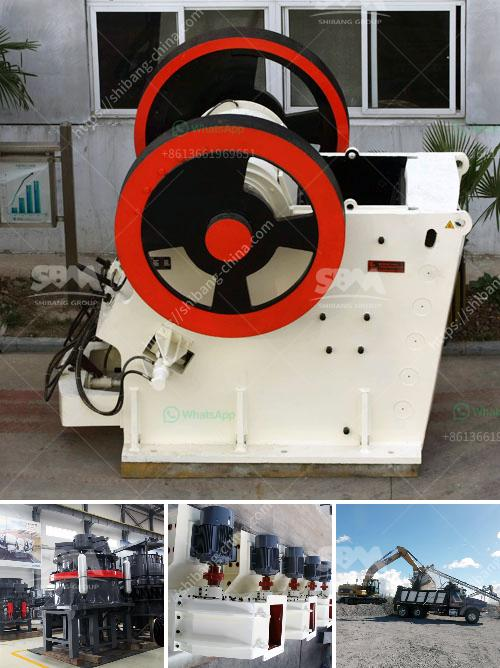

<h3>dry process for gold recovery</h3>
The dry process for gold recovery is a cost-effective and innovative method that involves minimal use of water. This process helps to extract gold particles from dry ore without the need for extensive water resources or the use of harmful chemicals. By using air flows, dry deposition occurs, resulting in the separation of gold particles from other materials.

One of the main advantages of the dry process for gold recovery is its environmental friendliness. Traditional methods of gold extraction involve the use of large amounts of water, which can lead to water pollution and the depletion of water resources. In comparison, the dry process requires minimal water, making it a sustainable and eco-friendly alternative.

Additionally, the dry process offers economic advantages. As water is a scarce resource in many regions, using the dry process allows for significant cost savings. Moreover, the dry process eliminates the need for expensive equipment and complex infrastructure typically associated with conventional gold recovery methods.

The dry process is also highly efficient in recovering gold particles. It utilizes the principle of gravity separation, where gold particles, being heavier than other materials, settle and separate from the lighter materials. This results in a higher concentration of gold particles, making the process more efficient and yielding higher gold recovery rates.

Overall, the dry process for gold recovery is a promising alternative to traditional methods. Its minimal use of water, environmental friendliness, and economic advantages make it a viable option for small-scale mining operations and regions where water resources are scarce. As advancements are made in technology and equipment, the dry process has the potential to revolutionize the gold mining industry, providing a more sustainable and efficient means of gold extraction.
<h3>Contact us</h3><ul><li><strong>Whatsapp:&nbsp;<a href="https://wa.me/8613661969651">+8613661969651</a></strong></li><li><a href="https://swt.shibang-china.com/?git&amp;zhl&amp;dry process for gold recovery"><strong>Online Service(chat now)</strong></a></li></ul><h3>Related</h3><ul><li><a href='rod mill manufacturer in europe.md'>rod mill manufacturer in europe</a></li><li><a href='100tpd cement grinding unit cost.md'>100tpd cement grinding unit cost</a></li><li><a href='sells hammer mills in zimbabwe.md'>sells hammer mills in zimbabwe</a></li><li><a href='lime stone crusher with capacity.md'>lime stone crusher with capacity</a></li><li><a href='chaines talc granding company in malaysia.md'>chaines talc granding company in malaysia</a></li></ul>