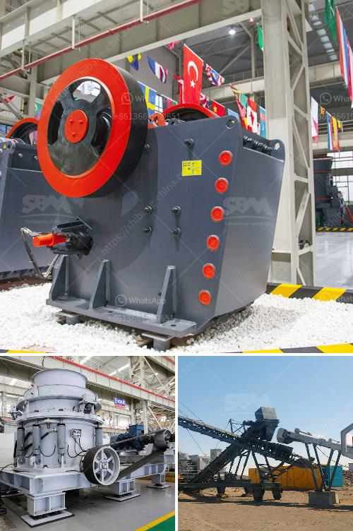

<h3>drywall recycling machine sales</h3>
Construction and demolition projects generate a massive amount of waste, and one of the major contributors is drywall. Drywall, also known as gypsum board or plasterboard, is a commonly used building material due to its cost-effectiveness and versatility. However, the disposal of drywall waste poses a significant environmental challenge, as it mainly ends up in landfills, contributing to pollution and resource depletion. To address this issue, the introduction of drywall recycling machines has emerged as a sustainable and profitable solution.

Drywall recycling machines are specially designed to efficiently process and recycle discarded drywall waste. These innovative machines can turn old or damaged drywall into usable materials, reducing the need for new drywall production and minimizing environmental impact. They help promote a circular economy model by transforming waste into valuable resources.

The sales of drywall recycling machines have been steadily increasing, fueled by the growing awareness and demand for sustainable practices in the construction industry. Contractors, waste management companies, and construction site operators have recognized the benefits of recycling drywall waste rather than sending it to landfills, which has led to a surge in the purchase of these machines.

One of the primary advantages of investing in a drywall recycling machine is the cost savings it offers. By recycling drywall waste on-site, construction companies can significantly reduce disposal costs, as they no longer need to pay for transportation and landfill fees. In addition, the recycled materials generated through the machine can be reused in various construction applications, which saves money on purchasing new materials.

Furthermore, drywall recycling machines contribute to the reduction of greenhouse gas emissions associated with traditional waste disposal. When drywall decomposes in landfills, it releases harmful gases such as hydrogen sulfide and methane, both of which are potent contributors to climate change. By recycling drywall waste, these machines divert it from landfills, effectively reducing greenhouse gas emissions and creating a more sustainable construction industry.

The recycled materials produced by drywall recycling machines can be used for a myriad of purposes, including the manufacturing of new drywall, soil amendment, and even animal bedding. This versatility adds to the appeal of the machines, as they offer a practical and environmentally-friendly solution to the waste problem.

Moreover, the adoption of drywall recycling machines aligns with the increasing regulatory pressure on construction companies to reduce their environmental impact. Many governments and municipalities have implemented stricter waste management regulations, encouraging businesses to adopt sustainable practices or face penalties. By investing in drywall recycling machines, construction companies can demonstrate their commitment to environmental stewardship and compliance with applicable laws.

In conclusion, the sales of drywall recycling machines have grown steadily as the construction industry embraces sustainable solutions. These machines not only save costs and reduce greenhouse gas emissions but also promote the circular economy model by transforming waste into valuable resources. Investing in drywall recycling machines is a win-win situation for both the environment and businesses, helping to build a greener and more sustainable future.
<h3>Contact us</h3><ul><li><strong>Whatsapp:&nbsp;<a href="https://wa.me/8613661969651">+8613661969651</a></strong></li><li><a href="https://swt.shibang-china.com/?git&amp;zhl&amp;drywall recycling machine sales"><strong>Online Service(chat now)</strong></a></li></ul><h3>Related</h3><ul><li><a href='river sand washing machine.md'>river sand washing machine</a></li><li><a href='hammer mill for silica stone.md'>hammer mill for silica stone</a></li><li><a href='hammer mill production location in nigeria.md'>hammer mill production location in nigeria</a></li><li><a href='cara menentukan kapasitas belt conveyor.md'>cara menentukan kapasitas belt conveyor</a></li><li><a href='used crusher for sale sell buy.md'>used crusher for sale sell buy</a></li></ul>