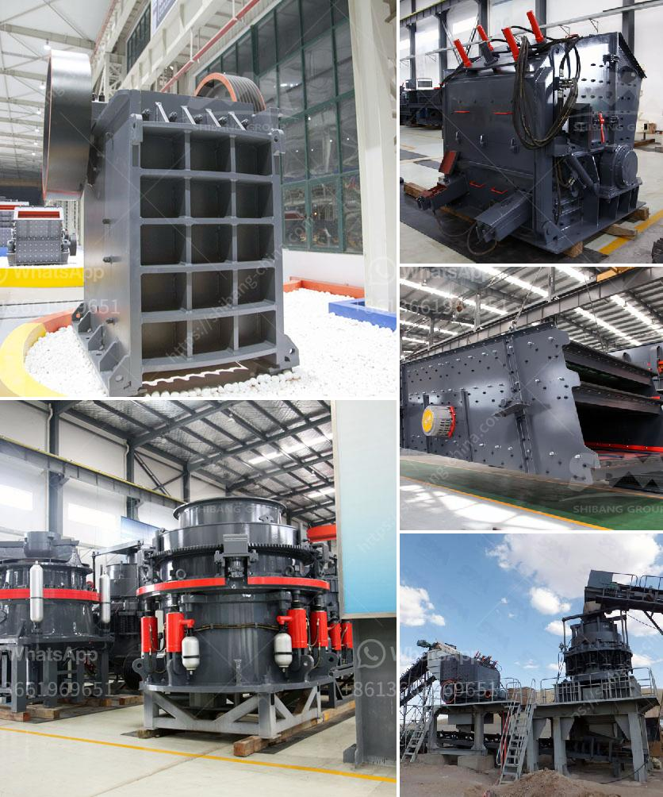

<h3>earthen clay products manufacturing process</h3>
Earthen clay products, such as bricks, tiles, and pottery, have been used by humans for centuries for various purposes. The manufacturing process of these products involves a combination of traditional techniques and modern technology to create durable and aesthetically pleasing items. This article will delve into the step-by-step process involved in the manufacturing of earthen clay products.

The first step in the manufacturing process is the extraction of clay from the earth. Clay can be found in various regions around the world and is obtained through mining or digging. The extracted clay is then transported to the production facility, where it goes through a series of refining processes.

Once at the facility, the clay is usually left to dry for a certain period to remove any excess moisture and improve its workability. This is an important step as too wet or too dry clay can affect the quality of the final product.

After drying, the clay is then mixed with other ingredients to enhance its properties. These ingredients may include sand, minerals, and additives that help with plasticity, color, and strength. The precise blend is determined by the desired characteristics of the final product.

Once the mixture is ready, it is placed into a machine called a pug mill or clay mixer. This machine kneads the clay to ensure a uniform consistency and remove any air bubbles. The kneaded clay is then shaped into the desired form, whether it be bricks, tiles, or pottery.

For brick production, the clay is usually shaped into rectangular blocks using molds or extrusion machines. The blocks are then left to dry in a controlled environment for several days. This drying process helps to remove any remaining moisture and strengthen the structure of the bricks.

Tiles, on the other hand, are typically formed by pressing the clay mixture into molds of various sizes and shapes. These molds can create different patterns and textures on the surface of the tiles. Once pressed, the tiles are also left to dry for a specified period.

Pottery manufacturing involves shaping the clay by hand or using a potter's wheel. The potter can create various vessels, bowls, or decorative items. After shaping, the pottery pieces are left to dry slowly to avoid cracking or deformation.

After the drying process, the earthen clay products go through a firing process. This involves placing the dried products in a kiln, where they are exposed to high temperatures ranging from 900 to 1,200 degrees Celsius. The firing process ensures that the clay undergoes chemical and physical changes, transforming it into a hard and durable material.

Once the earthen clay products have been fired, they can be left as is for a natural, earthy appearance or go through additional finishing processes. This may include glazing, painting, or applying a protective coating to the surface. These finishing touches enhance the functionality and aesthetics of the final product.

In conclusion, the manufacturing process of earthen clay products is a harmonious blend of traditional craftsmanship and modern technology. From clay extraction to shaping, drying, firing, and finishing, each step is crucial in creating durable, functional, and visually appealing clay products that have stood the test of time.
<h3>Contact us</h3><ul><li><strong>Whatsapp:&nbsp;<a href="https://wa.me/8613661969651">+8613661969651</a></strong></li><li><a href="https://swt.shibang-china.com/?git&amp;zhl&amp;earthen clay products manufacturing process"><strong>Online Service(chat now)</strong></a></li></ul><h3>Related</h3><ul><li><a href='impact crusher machine price.md'>impact crusher machine price</a></li><li><a href='silica sand price per ton.md'>silica sand price per ton</a></li><li><a href='limestone crushing.md'>limestone crushing</a></li><li><a href='grinding machinery manufecture in ajmer.md'>grinding machinery manufecture in ajmer</a></li><li><a href='used toner powder making machine price.md'>used toner powder making machine price</a></li></ul>