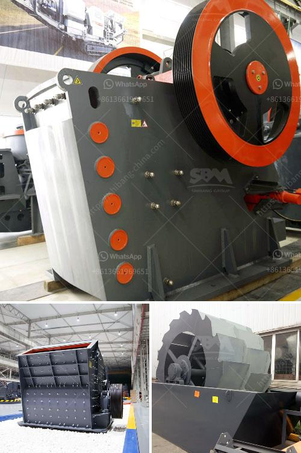

<h3>equipment equipments used in gravel crushing</h3>
When it comes to gravel crushing, there's a myriad of potential equipment options to choose from. Here at ABC Crusher Co., we believe that selecting the right equipment for the job is crucial for achieving the desired end product, ensuring efficient operation, and minimizing downtime.

One of the primary pieces of equipment utilized in gravel crushing is the jaw crusher. This machine is particularly well-suited for processing oversized gravel. With its wide feed opening and powerful crushing capabilities, the jaw crusher can efficiently reduce large gravel into smaller sizes suitable for further processing.

For finer gravel crushing, cone crushers are often the equipment of choice. These workhorses contain a rotating cone-shaped chamber that crushes the gravel between its walls. Cone crushers are renowned for their ability to produce a high-quality end product with excellent shape and size distribution, making them ideal for use in road construction and other demanding applications.

Another essential component in the gravel crushing process is the screening equipment. This equipment is tasked with separating the crushed gravel into different sizes for diverse applications. Vibrating screens and trommel screens are commonly used to achieve this goal. Vibrating screens are particularly efficient in removing fine particles and impurities, while trommel screens excel in processing larger quantities of gravel quickly.

To ensure maximum efficiency and reliability, it's crucial to consider the durability and robustness of the equipment. Gravel crushing can be a demanding operation, subjecting equipment to heavy loads and frequent impacts. Therefore, selecting equipment from reputable manufacturers known for their quality and longevity is vital.

Regular maintenance of gravel crushing equipment is also essential to guarantee its continued performance. This includes routine inspections, lubrication, and timely replacement of worn parts. Following manufacturer's guidelines and having a skilled maintenance team are crucial to minimize downtime and maximize productivity.

In conclusion, choosing the right equipment for gravel crushing is vital for producing high-quality gravel. Jaw crushers, cone crushers, and screening equipment play a key role in the production process, delivering optimal results in terms of size, shape, and cleanliness. Additionally, selecting durable equipment and implementing proper maintenance practices will ensure long-lasting performance and minimize downtime. At ABC Crusher Co., we understand the importance of quality equipment and are committed to providing our customers with the best solutions for their gravel crushing needs.
<h3>Contact us</h3><ul><li><strong>Whatsapp:&nbsp;<a href="https://wa.me/8613661969651">+8613661969651</a></strong></li><li><a href="https://swt.shibang-china.com/?git&amp;zhl&amp;equipment equipments used in gravel crushing"><strong>Online Service(chat now)</strong></a></li></ul><h3>Related</h3><ul><li><a href='price for jaw crusher.md'>price for jaw crusher</a></li><li><a href='turkey cone crusher kenya.md'>turkey cone crusher kenya</a></li><li><a href='coal crusher machine capacity of 5 tons an hour.md'>coal crusher machine capacity of 5 tons an hour</a></li><li><a href='smill grinding mill machine price.md'>smill grinding mill machine price</a></li><li><a href='granite quarry crushing plant.md'>granite quarry crushing plant</a></li></ul>