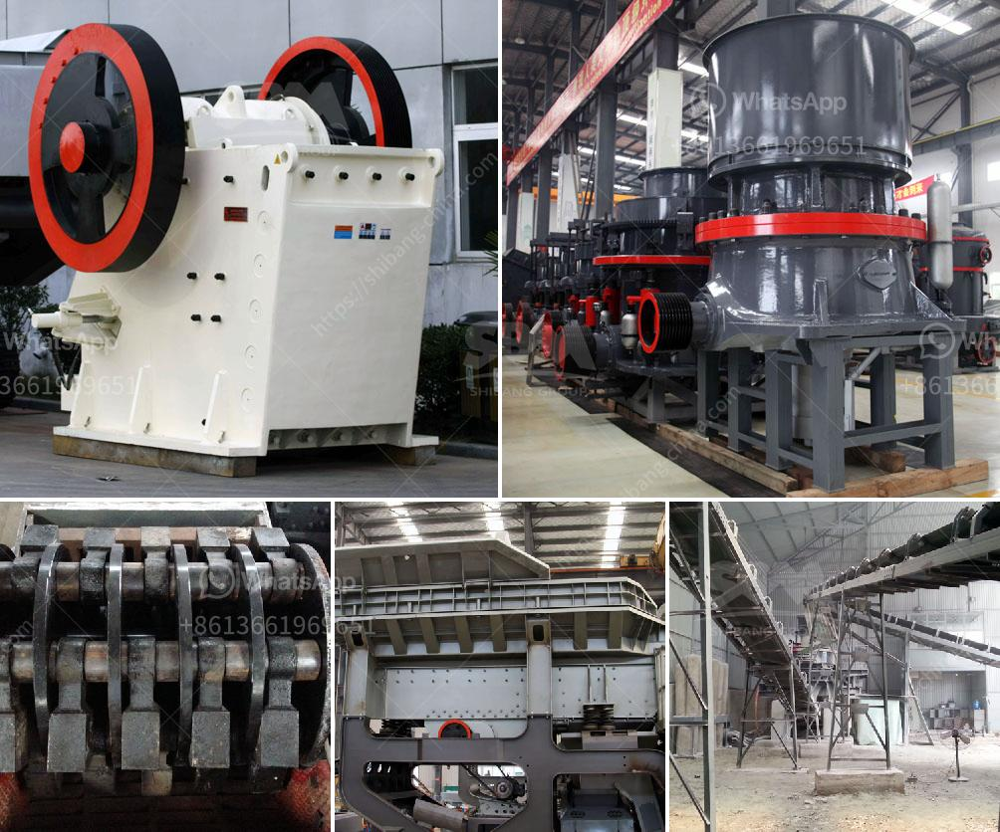

<h3>equipment needed for coal mining</h3>
Coal mining is an essential industry that requires the latest technology and equipment to maximize the extraction of coal. With coal being a significant contributor to global energy production, underground coal mines continue to be a core part of the industry. Numerous equipment are required for coal mining, such as excavators, dump trucks, conveyors, loaders, and underground drilling equipment.

Excavators are crucial equipment for coal mining, as they provide efficient digging and lifting capabilities. Excavators are used to remove coal and overburden (the material above the coal seam) by digging into the ground, breaking up the rock and soil to expose the coal. These machines come in various sizes, from small mini-excavators to large, heavy-duty excavators capable of handling large amounts of material.

Dump trucks are another essential piece of equipment for coal mining operations. They are used to transport the excavated coal from the mining site to the surface or to a processing plant. Dump trucks come in various sizes, with larger trucks capable of carrying several tons of coal. They are specially designed to handle the rugged conditions of mining sites and have powerful engines to efficiently transport the coal.

Conveyors are extensively used in coal mining operations to transport coal from one location to another. They are used to transport raw coal from the coal face to the surface and also used to transfer coal between different sections of the mine. Conveyors are efficient in moving large volumes of coal and reduce the need for manual labor in coal transportation. They are also helpful in reducing the risk of injuries or accidents related to manual handling.

Loaders are used in coal mining to load coal into trucks or conveyors for transportation. Loaders are equipped with buckets capable of handling large quantities of coal at once. They can efficiently load coal onto trucks or into a conveyor system, reducing time and increasing productivity. Loaders come in various sizes, ranging from compact loaders for small-scale operations to large wheel loaders for larger coal mines.

In underground coal mining, underground drilling equipment is required to access the coal seam. This equipment is used to drill holes in the rock or coal and insert explosive charges to break up the material for extraction. Underground drilling equipment is designed to withstand the harsh conditions of underground mines and provide precise drilling capabilities.

In addition to these primary equipment, coal mines also require auxiliary equipment such as ventilation systems, pumps, and safety equipment. Ventilation systems are essential to provide fresh air and remove harmful gases from underground coal mines. Pumps are used to remove water from the mine, preventing flooding and maintaining a dry working environment. Safety equipment, including personal protective equipment (PPE) and monitoring devices, are crucial to ensuring the safety and well-being of coal miners.

To conclude, coal mining relies on various equipment to efficiently extract coal from the ground. Excavators, dump trucks, conveyors, loaders, and underground drilling equipment are some of the key equipment needed for coal mining operations. This equipment enables mining companies to extract coal resources efficiently and safely, contributing to global energy production. As the industry evolves, newer technologies and equipment continue to be developed, aiming to improve the efficiency and sustainability of coal mining operations.
<h3>Contact us</h3><ul><li><strong>Whatsapp:&nbsp;<a href="https://wa.me/8613661969651">+8613661969651</a></strong></li><li><a href="https://swt.shibang-china.com/?git&amp;zhl&amp;equipment needed for coal mining"><strong>Online Service(chat now)</strong></a></li></ul><h3>Related</h3><ul><li><a href='ultra fine grinder advantages.md'>ultra fine grinder advantages</a></li><li><a href='the product of the stone crusher.md'>the product of the stone crusher</a></li><li><a href='new generation of hammer mill.md'>new generation of hammer mill</a></li><li><a href='coal mill pulverizer in thermal power plant.md'>coal mill pulverizer in thermal power plant</a></li><li><a href='the vertical mill ireland information.md'>the vertical mill ireland information</a></li></ul>