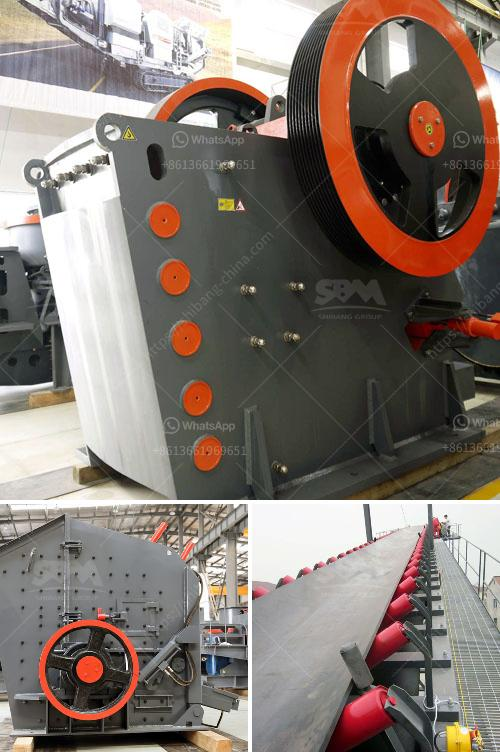

<h3>ethiopia conveyor belt india</h3>
Ethiopia, a country known for its rich history and cultural heritage, has been working tirelessly towards becoming a major player in the global industrial and economic arena. In line with this vision, Ethiopia has initiated several strategic partnerships, one of which is with India in the field of conveyor belt manufacturing.

Conveyor belts, an essential component of numerous industries, are used to transport goods or materials from one location to another, saving time and effort. The collaboration between Ethiopia and India in the manufacturing of conveyor belts aims to support the industrialization process in Ethiopia and boost its economic growth.

India, being a leading manufacturer and exporter of conveyor belts, has a well-established infrastructure, technical expertise, and experience in this domain. Ethiopia, on the other hand, possesses abundant natural resources and a rapidly growing economy. By joining forces, both nations can leverage each other's strengths and contribute to the development of their respective industries.

One of the key advantages of this partnership is the potential to generate employment opportunities. The conveyor belt manufacturing industry requires skilled labor for various tasks, including production, maintenance, and quality control. By establishing manufacturing units in Ethiopia, India can provide training and employment to the local workforce, thus addressing the issue of unemployment. Additionally, this collaboration can help develop a pool of skilled workers, which will be beneficial for the overall industrial growth of Ethiopia.

Another significant advantage of the Ethiopia-India conveyor belt partnership is the transfer of technology and knowledge. Indian companies can share their technical expertise and best practices with Ethiopian manufacturers, thereby enhancing the capabilities and competitiveness of the local industry. This knowledge exchange can lead to process improvements, quality enhancement, and innovation, fostering sustainable growth in Ethiopia's industrial sector.

Furthermore, this collaboration can stimulate foreign direct investment (FDI) in Ethiopia. The establishment of manufacturing units by Indian companies will attract FDI, as it opens up opportunities for joint ventures, technology transfers, and market expansion. This influx of investment will not only boost the conveyor belt manufacturing industry but also create a favorable investment climate that encourages other sectors to thrive.

In addition to job creation, technology transfer, and FDI, the Ethiopia-India conveyor belt partnership can enhance the productivity and efficiency of various industries. Conveyor belts are widely used in sectors such as mining, agriculture, manufacturing, and logistics, among others. By utilizing high-quality, locally manufactured conveyor belts, these industries can streamline their operations, reduce costs, and improve overall productivity. This, in turn, can contribute to the economic growth and competitiveness of Ethiopia in the global market.

To ensure the success of the Ethiopia-India conveyor belt partnership, both countries must prioritize collaboration, knowledge sharing, and continuous skill development. Establishing training centers and vocational institutes can help enhance the technical skills of the local workforce, ensuring that the industry has a sustainable talent pipeline.

In conclusion, the collaboration between Ethiopia and India in the manufacturing of conveyor belts holds significant potential for strengthening industrialization and economic growth in Ethiopia. This partnership offers employment opportunities, technology transfer, FDI, and productivity enhancements across various sectors. As both countries work together towards a shared vision, Ethiopia's journey towards becoming a global industrial hub will be propelled, opening doors to a sustainable and prosperous future.
<h3>Contact us</h3><ul><li><strong>Whatsapp:&nbsp;<a href="https://wa.me/8613661969651">+8613661969651</a></strong></li><li><a href="https://swt.shibang-china.com/?git&amp;zhl&amp;ethiopia conveyor belt india"><strong>Online Service(chat now)</strong></a></li></ul><h3>Related</h3><ul><li><a href='consumption ratio for ball mill.md'>consumption ratio for ball mill</a></li><li><a href='hammer mill manufacturer in tamilnadu.md'>hammer mill manufacturer in tamilnadu</a></li><li><a href='puzzolana 200 tph stage aggregate crushing.md'>puzzolana 200 tph stage aggregate crushing</a></li><li><a href='second hand quarry crusher machinery price in india.md'>second hand quarry crusher machinery price in india</a></li><li><a href='washing machine for small scale mining in ghana.md'>washing machine for small scale mining in ghana</a></li></ul>