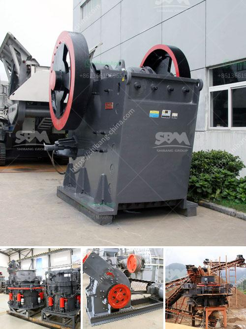

<h3>ethiopia conveyor belts china</h3>
In recent years, Ethiopia has established itself as an attractive investment destination, particularly for Chinese companies looking to expand their global reach. One sector that has experienced considerable growth is the conveyor belt industry. China's expertise in manufacturing and Ethiopia's abundance of natural resources have made the two countries an ideal partnership for the production and export of conveyor belts.

Ethiopia is known for its significant reserves of minerals such as gold, tantalum, and potash. These resources have attracted foreign investors seeking to capitalize on the country's untapped potential. Additionally, Ethiopia boasts a strategic geographic location, providing easy access to markets in Africa, Europe, and the Middle East. This combination of natural resources and accessibility has created a favorable environment for Chinese companies to establish their operations.

China, the world's largest manufacturer and exporter of conveyor belts, has seized this economic opportunity and developed strong trade ties with Ethiopia. Chinese manufacturers offer competitive prices, high-quality products, and advanced technology, making them the preferred choice for Ethiopian businesses in need of conveyor belt solutions. Notably, China's Belt and Road Initiative, a global infrastructure development plan, has further promoted cooperation between the two nations.

One of the key reasons behind the success of the Ethiopia-China conveyor belt partnership is the Chinese investment in local production facilities. Several Chinese companies have set up manufacturing plants in Ethiopia to produce conveyor belts using both domestic and imported materials. This localization strategy has created employment opportunities for Ethiopians and contributed to the country's industrialization efforts.

Moreover, the presence of Chinese manufacturing facilities has facilitated technology transfer and skill development. Local workers have access to advanced machinery and production techniques, enhancing their expertise in conveyor belt manufacturing. These skills have spilled over into other sectors, strengthening Ethiopia's overall manufacturing capabilities.

The collaboration between Ethiopia and China in the conveyor belt industry has not only benefited both countries' economies but also advanced sustainability goals. Conveyor belts are critical in various industries, including mining, manufacturing, and logistics. By producing these essential components locally, Ethiopia reduces its reliance on imports, improving self-sufficiency and reducing the carbon footprint associated with transportation.

Furthermore, Chinese investment has promoted environmental-friendly practices in Ethiopia's conveyor belt industry. Chinese manufacturers prioritize sustainability, offering eco-friendly options and implementing energy-efficient production processes. This commitment aligns with Ethiopia's goal of sustainable development and supports its initiatives to create a greener economy.

However, challenges remain. Ethiopia needs to continue investing in infrastructure development to fully utilize its natural resources and maximize the value of its conveyor belt industry. Improved logistics and transportation systems will enhance the country's competitiveness and attract more foreign investors.

Additionally, Ethiopia should focus on developing its local expertise and promoting entrepreneurship to leverage its partnership with China. The conveyor belt industry presents opportunities for Ethiopian entrepreneurs to establish their own manufacturing facilities and compete on a global scale.

In conclusion, the Ethiopia-China partnership in the conveyor belt industry is a shining example of mutually beneficial economic cooperation. The availability of natural resources combined with China's manufacturing prowess has created a thriving sector in Ethiopia. This collaboration not only supports the country's industrialization efforts and job creation but also furthers sustainability goals. With continued investments and a focus on local capacity building, the conveyor belt industry in Ethiopia is poised for further growth and success.
<h3>Contact us</h3><ul><li><strong>Whatsapp:&nbsp;<a href="https://wa.me/8613661969651">+8613661969651</a></strong></li><li><a href="https://swt.shibang-china.com/?git&amp;zhl&amp;ethiopia conveyor belts china"><strong>Online Service(chat now)</strong></a></li></ul><h3>Related</h3><ul><li><a href='malaysia industrial mill.md'>malaysia industrial mill</a></li><li><a href='ball mill in ceramic industry.md'>ball mill in ceramic industry</a></li><li><a href='aggregates crushing plant in angat bulacan.md'>aggregates crushing plant in angat bulacan</a></li><li><a href='rotary kiln producers in indonesia.md'>rotary kiln producers in indonesia</a></li><li><a href='stone to sand crusher.md'>stone to sand crusher</a></li></ul>