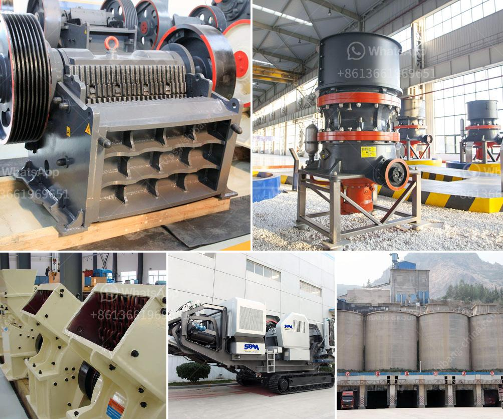

<h3>ethiopia crusher jaw crusher</h3>
In the construction industry, there is always a need for breaking and crushing materials. While this process can be achieved through various means, jaw crushers are the most common and popular machinery for this purpose. Ethiopia, being one of the fastest-growing economies in Africa, has been experiencing rapid infrastructure development in recent years. As a result, the demand for reliable crushing equipment such as jaw crushers has also seen a steady rise.

A jaw crusher is a type of primary crusher used in mines and ore processing plants. Jaw crushers are designed to crush the toughest materials through the use of compressive force (pressure). The jaw crusher design includes a set of two vertical jaws—a fixed (stationary) jaw and a swing (reciprocating) jaw. The swing jaw moves back and forth by a cam or pitman mechanism, acting like a nutcracker, crushing the material between the two jaws.

Ethiopia crusher jaw crushers are commonly used for mining, quarrying, and recycling applications. Also, they are commonly used in the production of building aggregates, road construction materials, and railway ballast. As a result, Ethiopia crusher jaw crushers have become indispensable equipment in the field of construction.

One of the prominent advantages of jaw crushers is their ability to process materials with high hardness. This factor is crucial, especially in the mining industry, where hard and abrasive materials such as granite, ores, and minerals are often encountered. Additionally, the simple structure and ease of maintenance make jaw crushers a reliable and cost-effective solution for crushing operations in Ethiopia.

The versatility of jaw crushers cannot be understated. They can handle a wide range of materials, including stone, concrete, asphalt, and ore. With their adjustable settings, jaw crushers can produce different sizes of crushed materials, making them ideal for various construction projects with specific requirements or specifications.

In conclusion, Ethiopia crusher jaw crushers have become an indispensable tool for the construction industry as they provide a reliable and versatile solution for crushing operations. Their ability to handle materials with high hardness and their adjustable settings make them suitable for a wide range of applications. With the ongoing infrastructure development in Ethiopia, the demand for jaw crushers is expected to continue to grow in the coming years.
<h3>Contact us</h3><ul><li><strong>Whatsapp:&nbsp;<a href="https://wa.me/8613661969651">+8613661969651</a></strong></li><li><a href="https://swt.shibang-china.com/?git&amp;zhl&amp;ethiopia crusher jaw crusher"><strong>Online Service(chat now)</strong></a></li></ul><h3>Related</h3><ul><li><a href='grinding equipments grinding equipments.md'>grinding equipments grinding equipments</a></li><li><a href='used philippines jaw crushers.md'>used philippines jaw crushers</a></li><li><a href='slag powder machine.md'>slag powder machine</a></li><li><a href='small hammer crusher.md'>small hammer crusher</a></li><li><a href='machinery needed for limestone extraction.md'>machinery needed for limestone extraction</a></li></ul>