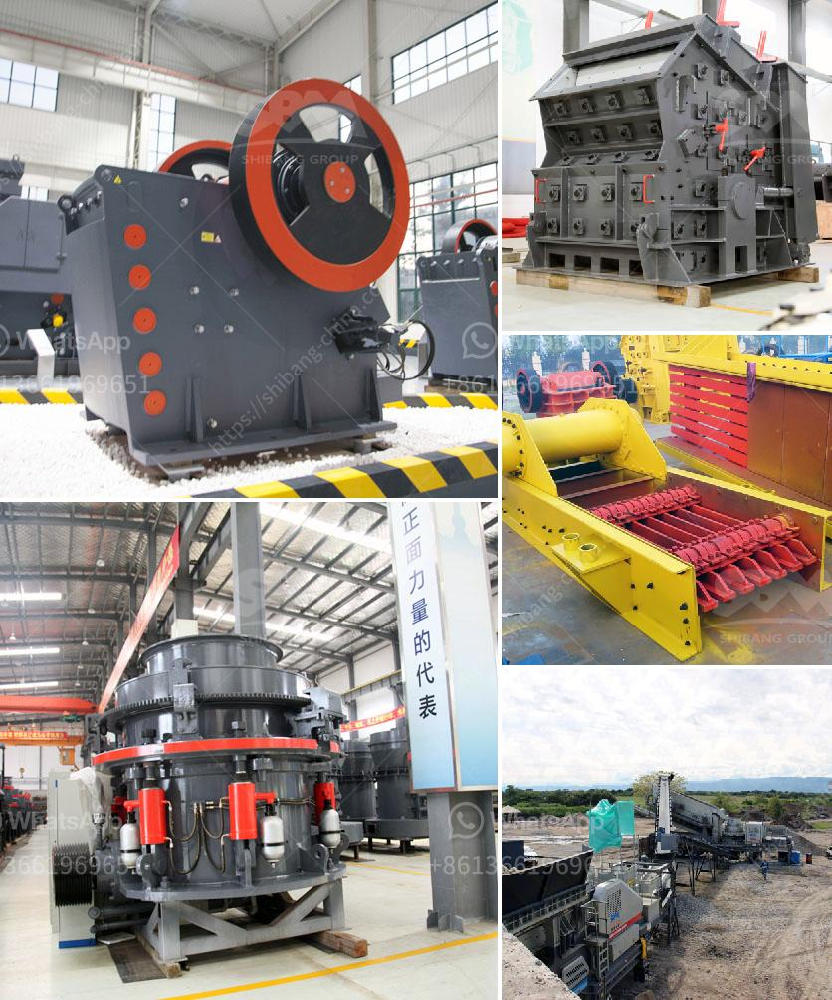

<h3>ethiopia rock crusher</h3>
Ethiopia, the land of rock and stone, is a country located in Eastern Africa. There is no denying that the terrain here is captivating and breathtaking, with its majestic mountains and winding valleys. One industry that has experienced a surge in growth in Ethiopia is the mining sector.

With the recent development in infrastructure projects and the construction boom, the demand for rocks and stones has increased exponentially. This has resulted in the need for efficient and reliable rock crushing machines. One such machine is the Ethiopia rock crusher.

Rock crushers are indispensable machines in the mining and quarrying industry. Different types of rock crushers exist depending on their size, shape, and function. One of the most popular rock crushers is the jaw crusher, which is used for primary crushing of stones or aggregates.

Started in 2002, the Rock Crushers exhibit at the Ethiopian Construction Fair has proved to be a major attraction to participants. It offers a unique opportunity for construction professionals to explore the latest construction technology and techniques used in rock crushing. The event showcases some of the most innovative rock crushers produced locally in Ethiopia.

The Ethiopia rock crusher is an innovative and effective tool for pulverizing various rocks or stones. It is beneficial to the construction industry as well as homeowners and other individuals. Some of the wide-ranging benefits of the rock crusher include:

2. Rock crushers are economical as they require minimum maintenance and long-term operational costs are low.

3. Crushed rocks can be reused in various construction projects, reducing waste and the need for additional materials.

4. The use of rock crushers promotes local employment opportunities, contributing to economic growth.

5. Rock crushers improve the efficiency of various construction processes, speeding up project completion timelines.

In conclusion, the Ethiopia rock crusher is a great addition to the construction industry. A rock crusher is an effective tool that offers an innovative solution to any crushing endeavor. It is highly beneficial to both the construction industry and individuals. With the growth of Ethiopia's construction sector, the demand for rock crushers will only increase in the years to come. Investing in a rock crusher will provide a long-term solution for crushing rocks and stones efficiently, contributing to sustainable development in Ethiopia.
<h3>Contact us</h3><ul><li><strong>Whatsapp:&nbsp;<a href="https://wa.me/8613661969651">+8613661969651</a></strong></li><li><a href="https://swt.shibang-china.com/?git&amp;zhl&amp;ethiopia rock crusher"><strong>Online Service(chat now)</strong></a></li></ul><h3>Related</h3><ul><li><a href='industrial mill and prices.md'>industrial mill and prices</a></li><li><a href='buy crusher of impact of 10 tph.md'>buy crusher of impact of 10 tph</a></li><li><a href='business plan of stone crushing companies.md'>business plan of stone crushing companies</a></li><li><a href='chaines talc granding company in malaysia.md'>chaines talc granding company in malaysia</a></li><li><a href='prices for stone crushing machine zimbabwe.md'>prices for stone crushing machine zimbabwe</a></li></ul>