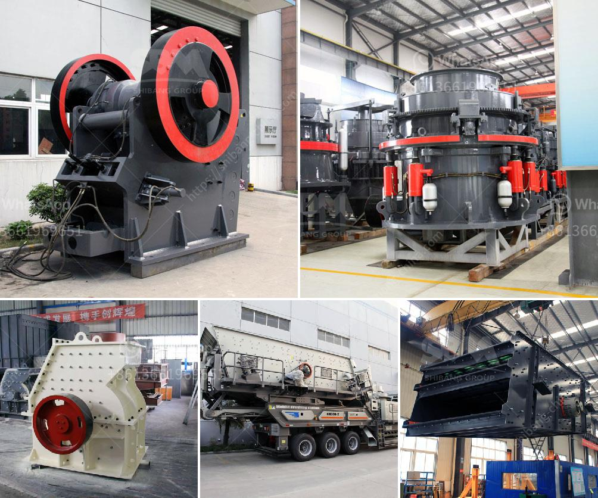

<h3>famous stone cone crusher for mining industry</h3>
The stone cone crusher is a machine used in the mining industry to break down large rocks into smaller pieces. With its powerful engine, it is capable of crushing rocks and converting them into aggregate material for construction sites or roads. This machine is also commonly used in aggregates production for the manufacturing of concrete and asphalt.

One of the most famous stone cone crushers in the mining industry is the Nordberg HP series. It was first introduced in 1989 as a new generation of cone crushers, replacing the Symons cone crusher. The HP crusher is widely used in aggregates production for the second, third, or fourth crushing stage in both stationary and mobile applications.

One of the primary advantages of the Nordberg HP series cone crusher is its versatility. Depending on the model, it can handle a wide range of production requirements, from coarse to fine crushing. It is capable of producing cubic-shaped end products, making it suitable for high-quality aggregate production.

Another notable feature of the Nordberg HP series cone crusher is its reliability. It is designed with robust components and optimized wear parts, ensuring high uptime and minimal maintenance. This leads to increased productivity and reduced operating costs for mining companies.

To enhance safety and ease of use, the Nordberg HP series cone crusher is equipped with various user-friendly features. These include a hydraulic setting adjustment, tramp release, and cavity clearing system, which allow for quick and easy changes to the crusher settings. Additionally, the cone crusher's automated control system optimizes performance and keeps track of maintenance intervals, ensuring optimal operation at all times.

The Nordberg HP series cone crusher also offers a wide range of optional features to enhance productivity and efficiency further. These include a motor and power options, different crushing chambers, and multiple eccentric throw options. This allows for customization according to specific needs and diverse applications.

Overall, the famous stone cone crusher, such as the Nordberg HP series, plays a significant role in the mining industry. It helps mining companies extract valuable minerals while producing high-quality aggregate materials for construction purposes. With its versatile capabilities, reliability, and user-friendly features, the stone cone crusher is a valuable asset for any mining operation.
<h3>Contact us</h3><ul><li><strong>Whatsapp:&nbsp;<a href="https://wa.me/8613661969651">+8613661969651</a></strong></li><li><a href="https://swt.shibang-china.com/?git&amp;zhl&amp;famous stone cone crusher for mining industry"><strong>Online Service(chat now)</strong></a></li></ul><h3>Related</h3><ul><li><a href='ball mill manufacturers in malaysia.md'>ball mill manufacturers in malaysia</a></li><li><a href='silica sand price per ton.md'>silica sand price per ton</a></li><li><a href='chalk manufacturing machinechalk mining machinery.md'>chalk manufacturing machinechalk mining machinery</a></li><li><a href='stone crusher for hire south africa.md'>stone crusher for hire south africa</a></li><li><a href='pulverized ball mill in malaysia.md'>pulverized ball mill in malaysia</a></li></ul>