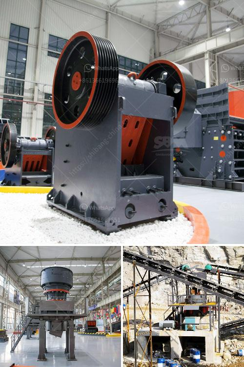

<h3>famous stone crushing equipment supplier in china</h3>
China is a famous country for its rich mineral resources. Stone crushing equipment plays a very important role in the mining industry. Different crushing equipment is used to process different materials, such as limestone, granite, pebble, sandstone, etc. In addition to the precious and hard materials, there are some materials with lower hardness that also can be processed by stone crushing equipment.

There are many famous stone crushing equipment suppliers in China. Shanghai Zenith Mining and Construction Machinery Co., Ltd. is one of them. With years of experience in researching and manufacturing stone crusher equipment, Zenith has developed a series of crushing and grinding equipment to meet different customers' needs.

Zenith not only produces jaw crushers, impact crushers, cone crushers, and other products but also provides a full range of mineral crushing plants. During the past decades, Zenith has won a good reputation among customers by good quality, competitive prices, and excellent service.

Firstly, let's look at the jaw crusher. The jaw crusher is a primary crushing equipment, which can crush hard materials such as granite, basalt, limestone, iron ore, gold ore, copper ore, etc. Jaw crusher is widely used in the fields of mining, building materials, metallurgy, highway and railway, water conservancy and so on.

Secondly, let's introduce the impact crusher. The impact crusher, also known as counterattack crusher, can handle different materials with a maximum size of 500 mm and compressive strength below 360 MPa. It is widely used in construction, highway, railway, energy, cement, chemical industry, etc.

Thirdly, we have the cone crusher. The cone crusher is suitable for crushing various ores and rocks with a hardness of medium or above. It has the features of reliable structure, high production efficiency, convenient adjustment, and low operation cost.

Last but not least, there is the high-pressure grinding mill, also known as Raymond mill. Raymond mill has a history of more than 100 years. With the continuous improvement and optimization of technology, it has become a common grinding equipment in industrial grinding industries such as mining, cement, and building materials.

In conclusion, as a famous stone crushing equipment supplier in China, Zenith Mining and Construction Machinery Co., Ltd. has made tremendous contributions to the development of the mining industry. It not only produces high-quality and efficient crushing equipment but also provides customers with a complete set of crushing and grinding production solutions. Whether it is jaw crusher, impact crusher, cone crusher or high-pressure grinding mill, Zenith can provide a tailored crushing solution for customers' different needs. With its advanced technology, reliable quality, and excellent service, Zenith has won the trust and support of customers at home and abroad.
<h3>Contact us</h3><ul><li><strong>Whatsapp:&nbsp;<a href="https://wa.me/8613661969651">+8613661969651</a></strong></li><li><a href="https://swt.shibang-china.com/?git&amp;zhl&amp;famous stone crushing equipment supplier in china"><strong>Online Service(chat now)</strong></a></li></ul><h3>Related</h3><ul><li><a href='raymond mills for sale.md'>raymond mills for sale</a></li><li><a href='crusher manufacturer in.md'>crusher manufacturer in</a></li><li><a href='jaw crusher plant for sale.md'>jaw crusher plant for sale</a></li><li><a href='jaw crusher manufacturers.md'>jaw crusher manufacturers</a></li><li><a href='operation and operation of a jaw crusher.md'>operation and operation of a jaw crusher</a></li></ul>