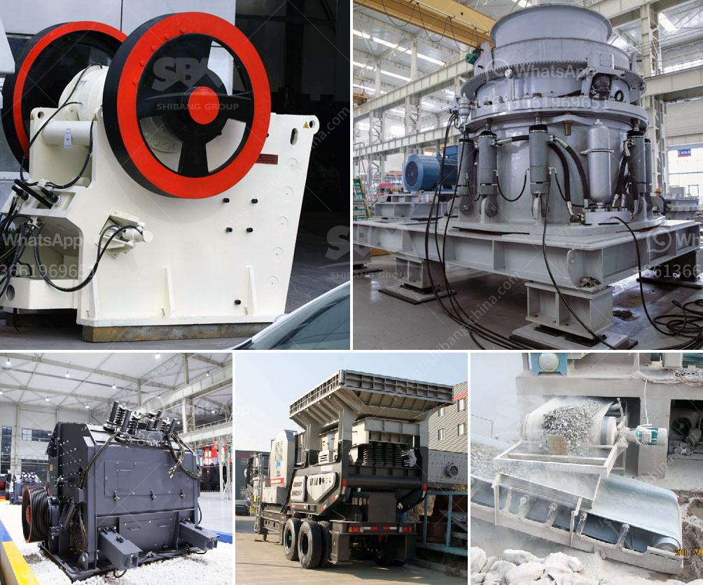

<h3>feasibility study for gypsum processing plant pdf</h3>
A feasibility study for the establishment of a gypsum processing plant is an important part of any investment planning process. This article highlights the key factors that you must consider before starting a gypsum processing plant. It includes the technical, financial, and market feasibility of the project.

The first step in conducting a feasibility study is to evaluate the technical feasibility of the project. This includes assessing the availability of raw materials, such as gypsum, the technology required for processing, and the infrastructure needed for transportation and storage. A thorough evaluation of these factors will determine the viability and suitability of setting up a gypsum processing plant.

Next, a financial feasibility analysis is crucial to determine the economic viability of the project. This includes estimating the capital investment required for setting up the plant, the operational costs, and the expected returns on investment. It is important to conduct a detailed cost-benefit analysis to assess the financial feasibility of the project and determine whether it will generate the desired returns.

Furthermore, a market feasibility analysis is essential to understand the demand and supply dynamics of the gypsum industry. This involves studying the market trends, customer preferences, and competitive landscape. It will help determine the market potential, product pricing, and sales forecast for the processed gypsum products.

Additionally, conducting a risk assessment is vital to identify and mitigate potential risks associated with the project. This may include analyzing factors such as environmental impact, regulatory constraints, and political stability, among others. Understanding and addressing these risks will help ensure the successful execution of the gypsum processing plant.

In conclusion, a feasibility study is a critical step in assessing the viability of a gypsum processing plant. It helps evaluate the technical, financial, and market feasibility of the project. By conducting a detailed analysis of these factors, investors can make informed decisions and mitigate risks associated with the establishment of a gypsum processing plant.
<h3>Contact us</h3><ul><li><strong>Whatsapp:&nbsp;<a href="https://wa.me/8613661969651">+8613661969651</a></strong></li><li><a href="https://swt.shibang-china.com/?git&amp;zhl&amp;feasibility study for gypsum processing plant pdf"><strong>Online Service(chat now)</strong></a></li></ul><h3>Related</h3><ul><li><a href='ball mill manufacture in chennai.md'>ball mill manufacture in chennai</a></li><li><a href='21 10 jaw crusher price in south afirca.md'>21 10 jaw crusher price in south afirca</a></li><li><a href='price list jaw crusher 150 x 200mm.md'>price list jaw crusher 150 x 200mm</a></li><li><a href='german crusher for sale.md'>german crusher for sale</a></li><li><a href='coal handling coal transfer by conveyors coal crusher.md'>coal handling coal transfer by conveyors coal crusher</a></li></ul>