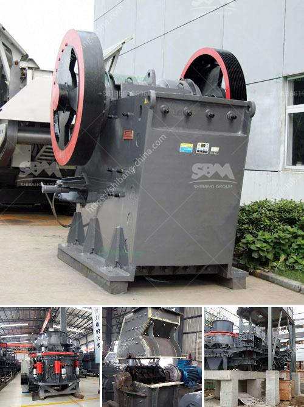

<h3>feasibility study for stone crusher plant</h3>
A stone crushing plant is primarily involved in the manufacture of aggregates of various sizes (coarse aggregates, crusher run, rock sand, and other fine aggregates) from basalt boulders. Coarse aggregates are usually used in ready mix concrete and asphaltic concrete. The current crushing plant is a fixed plant situated at Merriman, near Moonah quarry. The main aim of the project is to reduce the congestion occurring at Moonah Ramps, provide access to business and residential developments, and improve road safety by moving the crushing operations to the proposed site at Merriman. This article will discuss the feasibility study for setting up a crushing plant in Merriman.

The market for crushed stone aggregates includes contractors, civil engineering companies, builders, and individuals who require them for various construction projects. The demand for aggregates is increasing due to the rapid growth of infrastructure projects. The potential customers for this plant are numerous and spread across Tasmania.

The proposed stone crushing plant is equipped with advanced high-tech crushing machines and equipment, which can produce high-quality aggregates, meeting the market requirements. The crushing plant has a maximum capacity of 440 tons per hour and carries a circulating load of about 2:1 over the final screens and 1200 to 1400 tons per hour over the secondary screens. The plant is completely capable of producing crushed stones of various sizes depending on the final requirement.

Feasibility studies aim to logically justify the investment project, usually at the beginning of the project lifecycle. The analysis not only considers the economic feasibility of the project but also the technical, environmental, and legal aspects. This provides stakeholders with a comprehensive understanding of the project's potential risks and rewards during the planning phase.

The feasibility study will analyze the economic viability of the proposed plant. The study will provide a detailed financial model that considers the initial capital investment, operational costs, and revenue projections over a 10-year period. The financial analysis will consider variables like operational costs, production rates, sales volumes, and pricing strategies to create a realistic projection of cash flows. This will aid in identifying the project's profitability and potential returns on investment.

The feasibility study will carefully assess the environmental impact of the project. In areas of environmental significance, the study will identify potential impacts and propose mitigation strategies. It will ensure that the project complies with the environmental regulations and standards set by the local authorities. This includes ways to minimize noise pollution and dust emissions during the crushing operations.

The feasibility study for the proposed stone crushing plant would be based on the broad and relevant technical and financial analysis. It will cover all aspects of the project's economic viability, including the project's initiation, implementation, and operational phases. Additionally, the study would include an assessment of environmental impacts and the use of mitigation measures to minimize negative outcomes. The feasibility study will serve as an informative tool for decision-makers to determine whether the project is viable and should be pursued further. By conducting this study, stakeholders will be equipped with the necessary information to make informed decisions, ensuring the success of the stone crushing plant project.
<h3>Contact us</h3><ul><li><strong>Whatsapp:&nbsp;<a href="https://wa.me/8613661969651">+8613661969651</a></strong></li><li><a href="https://swt.shibang-china.com/?git&amp;zhl&amp;feasibility study for stone crusher plant"><strong>Online Service(chat now)</strong></a></li></ul><h3>Related</h3><ul><li><a href='ultrafine pulverizer.md'>ultrafine pulverizer</a></li><li><a href='process of cement making.md'>process of cement making</a></li><li><a href='construction construction belt.md'>construction construction belt</a></li><li><a href='used crushing plant in sweden or norwey.md'>used crushing plant in sweden or norwey</a></li><li><a href='quarries rock crushing process.md'>quarries rock crushing process</a></li></ul>