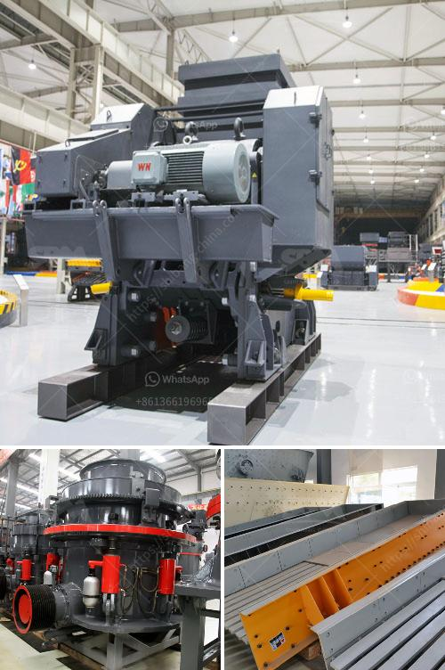

<h3>feasibility study quartz stone</h3>
A feasibility study is an essential step when considering any investment opportunity. In the case of quartz stone, a thorough analysis can help determine the viability of establishing a quartz stone manufacturing plant.

Quartz stone has gained immense popularity in recent years due to its exceptional durability and aesthetic appeal. Its unique properties make it an ideal material for a wide range of applications, including countertops, flooring, and wall cladding. As demand continues to rise, investing in a quartz stone plant seems like a lucrative business proposition.

The feasibility study would examine various factors, starting with market analysis. It would analyze the current and projected demand for quartz stone in the target market, identifying potential customers and their preferences. This research would help ascertain the market size, competition, and potential sales volume.

Furthermore, the study would evaluate the availability and accessibility of raw materials, primarily quartz deposits. Assessing the proximity of these deposits to the proposed manufacturing plant will determine the feasibility of procurement and transportation logistics. Additionally, the study would investigate the quality of available quartz deposits and any potential variations.

The feasibility study would also delve into the technological aspects of quartz stone production. It would explore the machinery and equipment required, along with their costs and maintenance considerations. An analysis of the labor market would assess the availability of skilled workers and their associated costs. This information would aid in estimating the project's financial feasibility, including the initial investment required and the potential return on investment.

Lastly, a feasibility study for quartz stone would focus on the regulatory and environmental aspects of the project. It would assess the necessary permits and licenses required to establish the manufacturing plant, ensuring compliance with local regulations. Additionally, the study would evaluate the potential environmental impact and propose mitigating measures to minimize any adverse effects.

In conclusion, a feasibility study of quartz stone presents an opportunity for investors to assess the viability of establishing a manufacturing plant. By analyzing market demand, raw material availability, technological requirements, labor market dynamics, and regulatory considerations, this study can provide crucial insights for making an informed decision. As quartz stone's popularity continues to soar, investing in its production may prove to be a profitable venture.
<h3>Contact us</h3><ul><li><strong>Whatsapp:&nbsp;<a href="https://wa.me/8613661969651">+8613661969651</a></strong></li><li><a href="https://swt.shibang-china.com/?git&amp;zhl&amp;feasibility study quartz stone"><strong>Online Service(chat now)</strong></a></li></ul><h3>Related</h3><ul><li><a href='mobile cone crushing station for sale.md'>mobile cone crushing station for sale</a></li><li><a href='sand wash plants for sale in texas.md'>sand wash plants for sale in texas</a></li><li><a href='construction construction belt.md'>construction construction belt</a></li><li><a href='stone crusher machine plant for sale in pakistan.md'>stone crusher machine plant for sale in pakistan</a></li><li><a href='sand conveyor for sale.md'>sand conveyor for sale</a></li></ul>