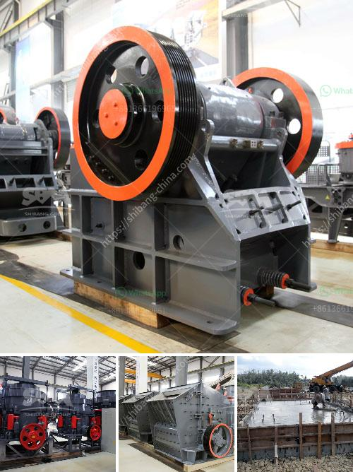

<h3>feldspar crusher for sale</h3>
Feldspar is one of the most abundant minerals in the earth's crust and is commonly found in igneous, metamorphic, and sedimentary rocks. It is primarily composed of silicate minerals, particularly aluminum and potassium. Feldspar is widely used in various industries, including ceramics, glass manufacturing, and construction materials.

To extract feldspar from the earth, the first step is mining. This involves deep drilling and blasting to access the feldspar ore. Once the ore is extracted, it goes through a series of crushing and grinding processes to obtain the desired particle size. This is where a feldspar crusher comes in.

A feldspar crusher is a machine designed to reduce large rocks into smaller rocks, gravel, or rock dust. It utilizes a metal crushing chamber and compression force to reduce the size of the rocks. This process produces a consistent and uniform particle size, making it easier to handle and process.

One of the advantages of using a feldspar crusher is its versatility. Depending on the application, a feldspar crusher can be configured to produce different sizes of crushed ore. This flexibility allows for the production of various products, such as gravel, sand, and fine powders. Additionally, a feldspar crusher can be equipped with different types of crushers, such as jaw crushers, cone crushers, and impact crushers, depending on the desired end product.

Another benefit of a feldspar crusher is its efficiency in crushing and grinding. The machine is designed to maximize the yield of usable material while minimizing energy consumption. This results in cost savings for the operator. Moreover, with advanced technology, modern feldspar crushers are also equipped with features that enhance safety and reduce maintenance requirements.

In conclusion, a feldspar crusher for sale offers numerous benefits for industries that rely on this versatile mineral. From its ability to produce different sizes of crushed ore to its efficient and reliable operation, a feldspar crusher is a valuable investment for any business. Whether used for construction materials or manufacturing processes, this machine can help maximize productivity and reduce operational costs.
<h3>Contact us</h3><ul><li><strong>Whatsapp:&nbsp;<a href="https://wa.me/8613661969651">+8613661969651</a></strong></li><li><a href="https://swt.shibang-china.com/?git&amp;zhl&amp;feldspar crusher for sale"><strong>Online Service(chat now)</strong></a></li></ul><h3>Related</h3><ul><li><a href='granite stones crusher.md'>granite stones crusher</a></li><li><a href='tons per year gypsum powder production line.md'>tons per year gypsum powder production line</a></li><li><a href='portable crushing and screening plant.md'>portable crushing and screening plant</a></li><li><a href='prices of harmer mills in south africa.md'>prices of harmer mills in south africa</a></li><li><a href='manufacturer of vibrating screens.md'>manufacturer of vibrating screens</a></li></ul>