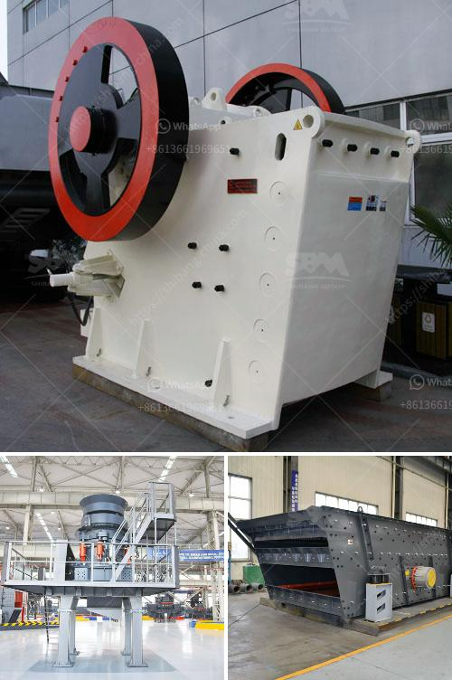

<h3>find fine jaw crusher in china</h3>
China has been a leading manufacturer and supplier of jaw crushers for decades. With its vast infrastructure and strong manufacturing capabilities, the country has become a go-to destination for anyone looking for high-quality crushers. Among the different types of jaw crushers available, the fine jaw crusher has gained significant popularity.

A fine jaw crusher, also known as a secondary crusher, is used to reduce the size of stones and ores into finer particles. This crusher is primarily used in various industrial sectors, such as mining, construction, and metallurgy. Its main purpose is to crush materials with a compressive strength of up to 320 MPa.

When searching for a fine jaw crusher in China, there are several factors to consider. Firstly, it is essential to choose a reputable manufacturer. China has a wide range of manufacturers, but not all of them uphold the same standards of quality. Conducting thorough research and reading customer reviews can help identify reliable companies that offer fine jaw crushers.

In addition, it is crucial to consider the specific requirements for the jaw crusher. Factors such as the desired capacity, input size, and output size play a crucial role in selecting the appropriate crusher. Communicating these requirements with the manufacturer can help ensure they provide the most suitable options.

Furthermore, understanding the after-sales services provided by the manufacturer is equally important. The availability of spare parts and technical support can greatly impact the crusher's lifespan and maintenance. Choosing a manufacturer who offers reliable after-sales support ensures long-term usability and reduces downtime.

Another aspect to consider is the price. While everyone wants to find a cost-effective solution, it is crucial not to compromise on quality. It is recommended to compare prices from different manufacturers and verify the quality of the materials used in the crusher's construction.

In conclusion, finding a fine jaw crusher in China requires thorough research and consideration of various factors. Identifying a reputable manufacturer, understanding the specific requirements, evaluating after-sales services, and balancing cost and quality are crucial steps in making an informed decision. With the right approach, one can find a fine jaw crusher in China that meets their needs and expectations.
<h3>Contact us</h3><ul><li><strong>Whatsapp:&nbsp;<a href="https://wa.me/8613661969651">+8613661969651</a></strong></li><li><a href="https://swt.shibang-china.com/?git&amp;zhl&amp;find fine jaw crusher in china"><strong>Online Service(chat now)</strong></a></li></ul><h3>Related</h3><ul><li><a href='roller crusher equipment supplier.md'>roller crusher equipment supplier</a></li><li><a href='machines for quarrying of stones.md'>machines for quarrying of stones</a></li><li><a href='process of cement making.md'>process of cement making</a></li><li><a href='crushing machine from china.md'>crushing machine from china</a></li><li><a href='grinding tunbe mill and ball mill.md'>grinding tunbe mill and ball mill</a></li></ul>