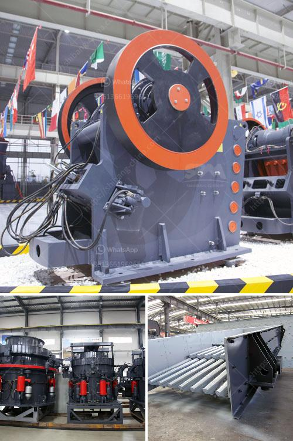

<h3>fine grinding mill for sale</h3>
Fine grinding mills are used in the process of reducing materials to a powder-like consistency. This type of mill is often used in various industries, such as mining and construction, to grind materials into smaller particles. With technological advancements, fine grinding mills have become more efficient and versatile, providing higher yields and finer particle sizes.

One of the most popular types of fine grinding mills for sale is the ball mill. This type of mill consists of a rotating cylinder filled with metal balls or rods, which act as the grinding media. The material to be ground is fed into the cylinder and is subjected to the grinding action of the media as the cylinder rotates. The result is a finer, more uniform particle size distribution.

Ball mills are widely used in many industries due to their versatility and efficiency. They can grind materials of various hardness levels, from soft to hard, and can operate in both wet and dry conditions. Additionally, ball mills can be used for continuous or batch grinding, allowing for flexibility in processing different materials.

Another type of fine grinding mill for sale is the vertical roller mill. This mill consists of several rotating rollers that grind materials by applying pressure. The material is fed into the mill and is squeezed between the rollers, resulting in a fine powder. Vertical roller mills are particularly suitable for grinding brittle materials, such as cement clinker and limestone, as they offer high grinding efficiency and low energy consumption.

In recent years, fine grinding mills have also incorporated advanced grinding technology, such as high-pressure grinding rolls (HPGR). HPGRs are used to reduce the energy consumption of the grinding process while maintaining or even improving product quality. HPGRs apply high pressure to the material being ground, resulting in a more efficient comminution process and finer particle size distribution.

When looking for a fine grinding mill for sale, it is important to consider various factors. These include the desired particle size range, required grinding capacity, and the specific materials to be processed. Additionally, it is essential to assess the reliability and maintenance requirements of the mill, as well as the availability of spare parts.

Furthermore, it is advisable to consult with industry experts or mill manufacturers to determine the most suitable mill for the specific application. They can provide valuable insights and recommend the best solutions based on their experience and expertise.

In conclusion, fine grinding mills play a crucial role in various industries, providing efficient and versatile solutions for reducing materials to a powder-like consistency. The availability of different types of mills, such as ball mills, vertical roller mills, and HPGRs, allows for flexibility in processing various materials. When looking for a fine grinding mill for sale, it is important to consider factors such as particle size range, grinding capacity, and maintenance requirements to ensure optimal performance and productivity.
<h3>Contact us</h3><ul><li><strong>Whatsapp:&nbsp;<a href="https://wa.me/8613661969651">+8613661969651</a></strong></li><li><a href="https://swt.shibang-china.com/?git&amp;zhl&amp;fine grinding mill for sale"><strong>Online Service(chat now)</strong></a></li></ul><h3>Related</h3><ul><li><a href='artificial sand making.md'>artificial sand making</a></li><li><a href='aggregates crusher cebu.md'>aggregates crusher cebu</a></li><li><a href='how much does it cost to open a crusher stone plant.md'>how much does it cost to open a crusher stone plant</a></li><li><a href='diesel grinding mills musina south africa.md'>diesel grinding mills musina south africa</a></li><li><a href='ball mill in mining.md'>ball mill in mining</a></li></ul>