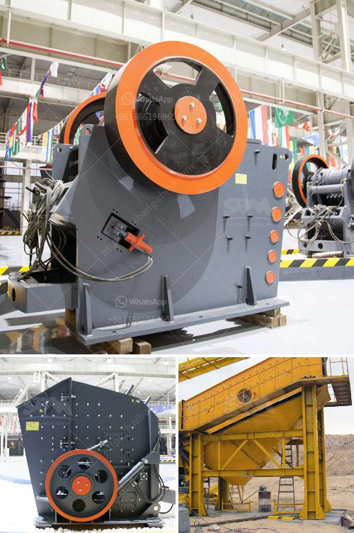

<h3>fine grinding mill specifications</h3>
Fine grinding mills are used in the mineral processing industry to grind materials into fine particles for further concentration or extraction. These mills are efficient and offer great performance in grinding various materials such as limestone, cement, coal, iron ore, and many others.

When selecting fine grinding mills, it is essential to consider the specifications of the mill to ensure its suitability for the desired application. The following are some key specifications to look out for:

1. Motor power: The motor power determines the mill's capacity to grind materials effectively. Higher motor power means a higher grinding capacity.

2. Grinding media: The type and size of the grinding media used in the mill impacts the fineness of the final product. It is important to choose the right grinding media to achieve the desired particle size distribution.

3. Feed size: The maximum feed size that the mill can handle is an important specification to consider. It determines the size of the materials that can be fed into the mill for grinding.

4. Grinding chamber volume: The volume of the grinding chamber affects the mill's capacity and efficiency. A larger chamber volume allows for more material to be processed at a time, leading to higher throughput.

5. Air classifier: Some fine grinding mills come equipped with an integrated air classifier. This feature is useful for controlling the particle size distribution and ensuring consistent product quality.

6. Energy consumption: Energy efficiency is an essential consideration for any milling process. Look for mills that offer low energy consumption without compromising performance.

7. Maintenance and operational requirements: Consider the ease of maintenance and operation when selecting a fine grinding mill. User-friendly designs and easy access to critical components can reduce downtime and enhance productivity.

Fine grinding mills play a crucial role in many industrial processes. By carefully considering the specifications of a mill, you can ensure optimal performance, efficiency, and product quality.
<h3>Contact us</h3><ul><li><strong>Whatsapp:&nbsp;<a href="https://wa.me/8613661969651">+8613661969651</a></strong></li><li><a href="https://swt.shibang-china.com/?git&amp;zhl&amp;fine grinding mill specifications"><strong>Online Service(chat now)</strong></a></li></ul><h3>Related</h3><ul><li><a href='aggregate washing machine saudi arabia.md'>aggregate washing machine saudi arabia</a></li><li><a href='ballast crusher plant.md'>ballast crusher plant</a></li><li><a href='stone crushing plant germany.md'>stone crushing plant germany</a></li><li><a href='jaw crusher in uzbekistan.md'>jaw crusher in uzbekistan</a></li><li><a href='salt crusher machine pakistan.md'>salt crusher machine pakistan</a></li></ul>