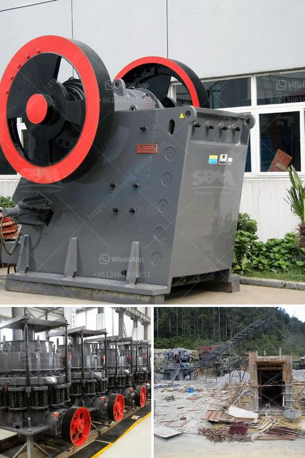

<h3>fine powder grinding mill</h3>
Fine powder grinding mill is a machine that grinds the materials into fine particles or powder. It is especially suitable for the grinding of brittle materials with low hardness, such as calcite, chalk, limestone, dolomite, kaolin, bentonite, talc, mica, magnesite, illite, pyrophyllite, vermiculite, sepiolite, attapulgite, rectorite, diatomite, barite, gypsum, alunite, graphite, fluorite, phosphate rock, potassium ore, pumice, etc.

There are several types of fine powder grinding mill machines available on the market, including Raymond mill, high-pressure grinding mill, ultra-fine grinding mill, and vertical grinding mill. Each type has its own set of features and advantages, which can satisfy different grinding requirements.

Raymond mill, also known as Raymond roller mill, is a widely used grinding machine for processing non-metallic ores with Mohs hardness below 7 and humidity less than 6%. It is widely used in the fields of metallurgy, construction, chemical industry, mining, highway construction, etc. The final product size can be adjusted from 30 to 325 mesh, which makes Raymond mill suitable for both coarse and fine grinding applications.

High-pressure grinding mill, also known as high-pressure roller mill, is a grinding machine designed to grind various non-metallic minerals with Mohs hardness below 9.3 and humidity below 6%. It is widely used in the fields of metallurgy, construction, chemical industry, mining, highway construction, etc. The final product size can be adjusted from 80 to 425 mesh, which makes high-pressure grinding mill suitable for fine grinding and super fine grinding applications.

Ultra-fine grinding mill, also known as ultra-fine mill, is a grinding machine designed to grind various non-metallic minerals with Mohs hardness below 7 and humidity below 6%. It is widely used in the fields of metallurgy, construction, chemical industry, mining, highway construction, etc. The final product size can be adjusted from 325 to 2500 mesh, which makes ultra-fine grinding mill suitable for ultra-fine grinding applications.

Vertical grinding mill, also known as vertical roller mill, is a grinding machine designed to grind various non-metallic minerals with Mohs hardness below 7 and humidity below 6%. It is widely used in the fields of metallurgy, construction, chemical industry, mining, highway construction, etc. The final product size can be adjusted from 80 to 1250 mesh, which makes vertical grinding mill suitable for both coarse and fine grinding applications.

In conclusion, fine powder grinding mill is a machine that grinds the materials into fine particles or powder. It has various types and models available, such as Raymond mill, high-pressure grinding mill, ultra-fine grinding mill, and vertical grinding mill. Each type has its own set of features and advantages, which can satisfy different grinding requirements. It is widely used in the fields of metallurgy, construction, chemical industry, mining, highway construction, etc. If you are in need of a fine powder grinding mill, it is recommended to choose the appropriate type based on your specific needs and requirements.
<h3>Contact us</h3><ul><li><strong>Whatsapp:&nbsp;<a href="https://wa.me/8613661969651">+8613661969651</a></strong></li><li><a href="https://swt.shibang-china.com/?git&amp;zhl&amp;fine powder grinding mill"><strong>Online Service(chat now)</strong></a></li></ul><h3>Related</h3><ul><li><a href='clay crusher manufacturing process.md'>clay crusher manufacturing process</a></li><li><a href='stone crushing machine manufacturers in japan.md'>stone crushing machine manufacturers in japan</a></li><li><a href='50 tpd iron crusher machinery cost.md'>50 tpd iron crusher machinery cost</a></li><li><a href='tanzania medical equipment supplier.md'>tanzania medical equipment supplier</a></li><li><a href='jaw crusher for sale kenya.md'>jaw crusher for sale kenya</a></li></ul>