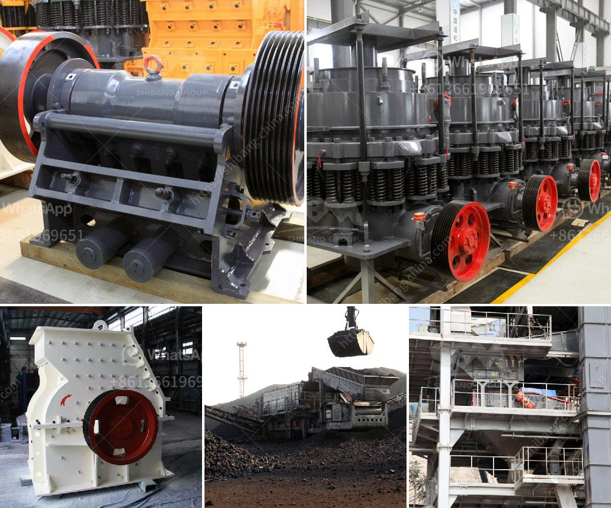

<h3>fine powder mill</h3>
The fine powder mill is a revolutionary tool that has transformed the way industries process materials. With its efficient grinding capability, this machine has become a must-have for many businesses, from pharmaceuticals to chemical processing. In this article, we will explore the features and benefits of the fine powder mill, along with its applications in various industries.

One of the key features of the fine powder mill is its ability to grind materials into a fine powder. This is achieved through a combination of centrifugal and grinding forces, allowing for precise and controlled milling. The mill is equipped with high-quality grinding media, such as stainless steel balls or ceramic beads, which ensure consistent particle size reduction. This makes it ideal for applications where a fine and uniform powder is required.

In the pharmaceutical industry, the fine powder mill plays a crucial role in the production of medicines and drugs. It is used to grind various ingredients, such as herbs, roots, and pharmaceutical compounds, into fine powders. These powders are then further processed into tablets, capsules, or liquid formulations. The precise control over particle size allows pharmaceutical manufacturers to produce drugs with specific dissolution rates and improved bioavailability.

The fine powder mill is also widely used in the chemical industry, where it is essential for the production of various chemicals and compounds. It can grind materials such as pigments, dyes, and resins into fine powders, which are then used in the manufacturing of paints, coatings, and polymers. The versatility of the mill allows for different materials to be processed, giving chemical manufacturers the flexibility to adapt to different formulations and customer requirements.

Furthermore, the fine powder mill is indispensable in the food and beverage industry. It is commonly used to grind spices, herbs, and grains into powders, enhancing their aroma and flavor. This is particularly important in the production of seasonings, sauces, and beverage mixes, where a consistent particle size is crucial to achieve a uniform taste and texture.

Beyond these industries, the fine powder mill finds application in other sectors as well. It is employed in the production of construction materials, such as cement and concrete. The milling process ensures the uniform distribution of the raw materials, resulting in improved strength and durability of the final product.

Overall, the fine powder mill is a versatile tool that offers numerous benefits across various industries. Its ability to grind materials into a precise and uniform powder has revolutionized the manufacturing processes in pharmaceuticals, chemicals, food and beverages, and construction materials. With its efficiency and control over particle size, this machine has become an indispensable asset for businesses seeking to enhance their productivity and product quality. Whether you are a pharmaceutical manufacturer or a food processor, integrating a fine powder mill into your production line can certainly help you achieve superior results.
<h3>Contact us</h3><ul><li><strong>Whatsapp:&nbsp;<a href="https://wa.me/8613661969651">+8613661969651</a></strong></li><li><a href="https://swt.shibang-china.com/?git&amp;zhl&amp;fine powder mill"><strong>Online Service(chat now)</strong></a></li></ul><h3>Related</h3><ul><li><a href='new technology stone crusher in india.md'>new technology stone crusher in india</a></li><li><a href='limestone treatment plant.md'>limestone treatment plant</a></li><li><a href='3 stamp gold mill pictures.md'>3 stamp gold mill pictures</a></li><li><a href='speed in rollal mill.md'>speed in rollal mill</a></li><li><a href='sand making production line.md'>sand making production line</a></li></ul>