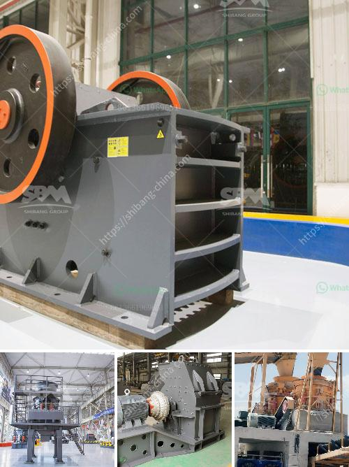

<h3>flow chart gypsum production</h3>
Gypsum, also known as calcium sulfate dihydrate, is a soft mineral that has been used as a construction material for centuries. With its numerous properties and versatility, gypsum plays a crucial role in various industries, including construction, agriculture, and even medicine. To better understand the process of gypsum production, let's take a closer look at the flow chart involved in its manufacturing.

The process of gypsum production starts with the extraction of gypsum ore from mines or quarries. These mines may be underground or open-pit mines, depending on the depth and accessibility of the gypsum deposit. Once the ore is extracted, it undergoes primary crushing, typically by a jaw crusher, to reduce the size of the material.

After the primary crushing stage, the gypsum ore is further crushed using a cone crusher or impact crusher to obtain a uniform size. This step is essential as it ensures the gypsum is finely ground for subsequent processing. The crushed ore is then sent to a grinding mill, where it is mixed with water to form a slurry.

The slurry is pumped into a gypsum slurry set, typically consisting of a mixer, a flow-control valve, and a storage tank. Within the storage tank, the slurry is aged for a certain period to allow the gypsum particles to settle and separate from impurities such as clay, sand, or stone. This aging process is crucial as it ensures a high-quality end product.

Once the slurry has aged sufficiently, it is transferred to a gypsum kiln, where the moisture content is removed. The kiln operates at high temperatures, typically above 150°C (300°F), causing the water within the slurry to evaporate, leaving behind the dried gypsum particles. During this calcination process, the gypsum undergoes a chemical transformation, converting to a hemihydrate form known as calcium sulfate hemihydrate (CaSO4·0.5H2O).

The dried gypsum particles are then ground into a fine powder in a rotating ball mill. The ball mill uses steel balls that pulverize the gypsum into a fine powder, ensuring a consistent particle size distribution. The powdered gypsum is collected in a cyclone separator and stored in silos for further processing or packaging.

Depending on the desired final product, additional additives may be included in the gypsum production process. For example, if the gypsum is intended for use in construction, it may be mixed with additives such as fly ash or lime to enhance its properties. These additives can improve the setting time, strength, and workability of the final gypsum-based product.

In conclusion, the production of gypsum involves several essential steps that ensure the high-quality and consistency of the final product. From the extraction of gypsum ore to its primary and secondary crushing, from the grinding stage to the slurry aging and calcination processes, each step plays a crucial role in transforming gypsum into a valuable resource. Understanding the flow chart of gypsum production helps us appreciate the effort and precision put into producing this versatile and indispensable material.
<h3>Contact us</h3><ul><li><strong>Whatsapp:&nbsp;<a href="https://wa.me/8613661969651">+8613661969651</a></strong></li><li><a href="https://swt.shibang-china.com/?git&amp;zhl&amp;flow chart gypsum production"><strong>Online Service(chat now)</strong></a></li></ul><h3>Related</h3><ul><li><a href='process of making quartz marble crusher.md'>process of making quartz marble crusher</a></li><li><a href='iron ore beneficiation proposal.md'>iron ore beneficiation proposal</a></li><li><a href='hammer mill production location in nigeria.md'>hammer mill production location in nigeria</a></li><li><a href='price list of cone crushers made in china.md'>price list of cone crushers made in china</a></li><li><a href='top ten manufacturers of stone crusher in the world.md'>top ten manufacturers of stone crusher in the world</a></li></ul>