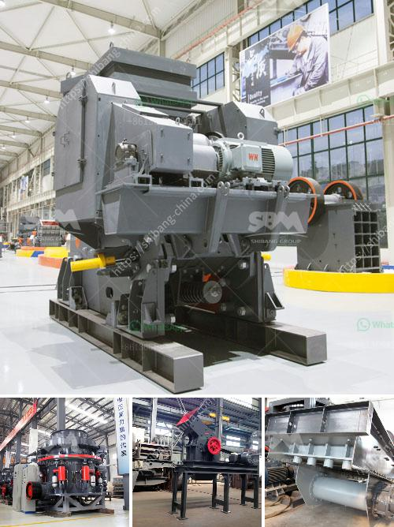

<h3>fly ash electrostatic separator manufacturer</h3>
Fly ash, a waste product resulting from the combustion of coal in power plants, has been a significant environmental concern for many years. However, advancements in technology and the development of innovative solutions have provided opportunities to tackle this problem effectively. One such solution is the fly ash electrostatic separator, a crucial equipment that has been instrumental in the efficient management and disposal of fly ash. In this article, we will explore the importance of the fly ash electrostatic separator manufacturer in this process.

The fly ash electrostatic separator is a device that utilizes the principles of electrostatic charging and separation to separate fly ash particles based on their characteristics and composition. It works on the principle of triboelectrification, where particles with differing electric charges are attracted or repelled by an electrostatic field, leading to their separation. This separation process is highly efficient and allows for the recovery of valuable materials from fly ash, reducing its environmental impact significantly.

The role of the fly ash electrostatic separator manufacturer in this process is crucial. These manufacturers design, develop, and produce the electrostatic separators, ensuring that they meet the highest quality standards and are capable of handling large volumes of fly ash. They employ a team of experts well-versed in the technology and science behind the separation process to optimize the efficiency and performance of the equipment.

A reliable fly ash electrostatic separator manufacturer conducts extensive research and development to continually improve the design and functionality of their products. They invest in state-of-the-art manufacturing facilities and utilize advanced manufacturing techniques to produce high-quality separators. These manufacturers are also responsible for providing technical support and aftersales services, ensuring that the separators operate smoothly and efficiently.

The impact of a fly ash electrostatic separator manufacturer goes beyond the production of the equipment. They play a pivotal role in promoting sustainable and environmentally friendly practices by enabling the effective management and utilization of fly ash. By separating valuable materials from fly ash, such as metals and carbon, these manufacturers contribute to the reduction of waste generation and the conservation of natural resources.

Furthermore, the fly ash electrostatic separator manufacturer also helps power plants and other industries comply with environmental regulations. By providing them with reliable separators, these manufacturers enable their customers to effectively treat and dispose of fly ash in an environmentally responsible manner.

In conclusion, the fly ash electrostatic separator manufacturer plays a crucial role in addressing the challenges associated with fly ash disposal. They design, develop, and produce high-quality separators that utilize electrostatic charging and separation principles to efficiently manage and utilize fly ash. By promoting sustainable practices and contributing to environmental conservation, these manufacturers are at the forefront of combating the environmental impact of fly ash waste.
<h3>Contact us</h3><ul><li><strong>Whatsapp:&nbsp;<a href="https://wa.me/8613661969651">+8613661969651</a></strong></li><li><a href="https://swt.shibang-china.com/?git&amp;zhl&amp;fly ash electrostatic separator manufacturer"><strong>Online Service(chat now)</strong></a></li></ul><h3>Related</h3><ul><li><a href='stone crushar plant price list stone.md'>stone crushar plant price list stone</a></li><li><a href='gypsum board making plant from germany.md'>gypsum board making plant from germany</a></li><li><a href='hammer mills produced in brazil.md'>hammer mills produced in brazil</a></li><li><a href='the vertical mill ireland information.md'>the vertical mill ireland information</a></li><li><a href='grinding machinery manufecture in ajmer.md'>grinding machinery manufecture in ajmer</a></li></ul>