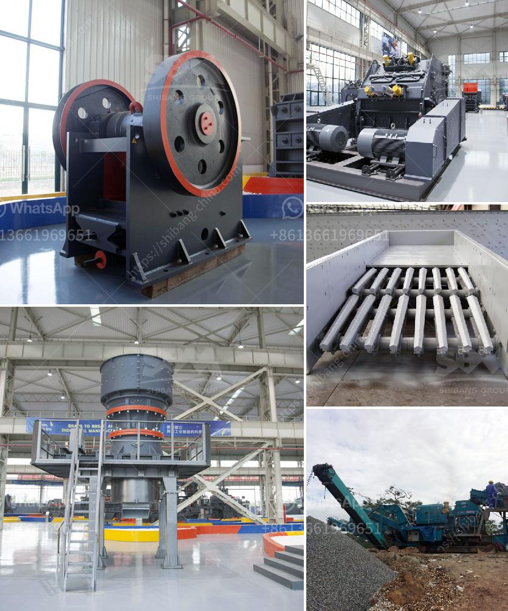

<h3>for sale prices jaw crushe</h3>
For industries requiring efficient crushing solutions, jaw crushers have become a popular choice. These robust machines offer exceptional performance in reducing a variety of hard materials into smaller, more manageable sizes. Whether used in mining, construction, or recycling applications, a jaw crusher is a vital tool that maximizes productivity and profitability. In this article, we will explore the jaw-dropping features and discuss the price range of jaw crushers available for sale.

1. Powerhouse Performance: Jaw crushers are designed to deliver powerful crushing capabilities. Equipped with a top-quality motor, they efficiently process various materials, including hard rocks, ores, and demolition debris. Their jaws exert substantial force to break down materials into smaller fragments, ensuring a consistent output size.

2. Versatility in Adjustment: Jaw crushers come with adjustable settings to cater to different crushing requirements. The ability to regulate the size of the output product allows users to achieve precise results for their specific applications. With the flick of a switch or the turn of a dial, operators can easily adjust the crushers to different settings.

3. Robust Construction: Jaw crushers are engineered to withstand heavy-duty operations. Built with sturdy materials and components, they offer long-lasting durability, minimizing downtime and maintenance costs. The robust construction also ensures that jaw crushers can handle tough materials without compromising performance.

4. Safety Features: To prioritize operator safety, modern jaw crushers incorporate advanced safety features. These include safety mechanisms that prevent accidental starting, emergency stops, and guarding around moving parts. These safety features provide peace of mind to operators and promote a safe working environment.

5. Ease of Maintenance: Jaw crushers are designed to facilitate easy maintenance. They often feature quick access to key components for efficient servicing, such as changing jaw plates or adjusting tension on the drive belts. Minimal downtime during maintenance results in increased productivity and cost savings.

The prices of jaw crushers on the market can vary significantly based on various factors, ranging from the brand, model, condition of the machine to its size and capacity. The price of a jaw crusher typically ranges from tens of thousands to hundreds of thousands of dollars.

The technical parameters of the crusher, such as feed size, output size, and motor power, will also affect the crusher price. Additionally, prices vary depending on the market competition in your region. On average, the jaw crusher price will fluctuate between $3,000 and $30,000.

The decision regarding which jaw crusher to purchase will primarily depend on your specific industry requirements and the stage of crushing you are targeting (primary, secondary, or tertiary). Conduct thorough research and compare various models from different manufacturers to find the best fit for your needs and budget. 

Jaw crushers are indispensable machines in various industries due to their powerful performance, robust construction, and versatility. Considering their jaw-dropping features, it becomes evident that investing in a jaw crusher can significantly enhance your crushing operations. When looking to purchase a jaw crusher, be sure to evaluate various models and their features, as well as consider your specific requirements and budget. Remember, choosing a jaw crusher that aligns with your needs will ensure you get the most out of your investment and drive optimal productivity and profitability.
<h3>Contact us</h3><ul><li><strong>Whatsapp:&nbsp;<a href="https://wa.me/8613661969651">+8613661969651</a></strong></li><li><a href="https://swt.shibang-china.com/?git&amp;zhl&amp;for sale prices jaw crushe"><strong>Online Service(chat now)</strong></a></li></ul><h3>Related</h3><ul><li><a href='jaw crushers china.md'>jaw crushers china</a></li><li><a href='rock crusher for granite.md'>rock crusher for granite</a></li><li><a href='coal manufacturing machine price in malaysia.md'>coal manufacturing machine price in malaysia</a></li><li><a href='price of roller mill machine.md'>price of roller mill machine</a></li><li><a href='vibrating screen analysis.md'>vibrating screen analysis</a></li></ul>