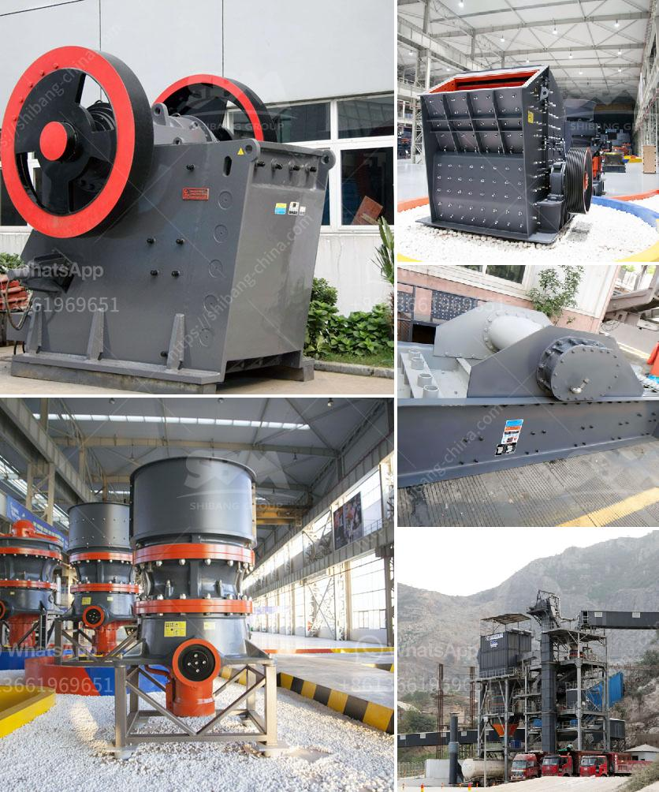

<h3>frac sand conveyor price</h3>
In the world of hydraulic fracturing or fracking, the mining and transportation of frac sand plays a crucial role. Frac sand is a type of high-purity quartz sand that is used in the fracking process to create fractures in underground rock formations, allowing the extraction of oil and gas. To efficiently transport this sand from mines to the fracking sites, frac sand conveyors are employed. However, one of the essential considerations in this industry is the price of these conveyors, as it directly impacts the overall fracking operation's cost-effectiveness.

Frac sand conveyors come in various types and sizes, designed to meet the specific requirements of each fracking project. The price of these conveyors can vary based on factors such as their length, capacity, materials used in construction, and additional features. Longer conveyors naturally tend to be more expensive due to the increased materials and complexity required for their construction. Similarly, conveyors with higher capacities are typically priced higher due to the need for robust mechanisms to handle larger volumes of sand.

Another crucial aspect that affects the price of frac sand conveyors is the material used in their construction. Generally, conveyors made from stainless steel, which provides excellent resistance to corrosion and abrasion, tend to have a higher price tag compared to those made from carbon steel or other materials. The choice of material depends on the specific needs of the fracking operation, with durability and longevity being key considerations.

Additional features and customization requirements can also influence the price of frac sand conveyors. For instance, conveyors equipped with adjustable height mechanisms or mobile capabilities may be pricier than standard fixed-height conveyors. Customization options like inclined or curved conveyors, dust control systems, and remote monitoring capabilities can add to the overall cost. However, it is essential to weigh the potential benefits and increased efficiency these features might provide against their costs.

Apart from the initial purchase price of frac sand conveyors, it is also crucial to consider the maintenance and operational costs. Reliable conveyors with minimal downtime and low maintenance requirements might have a higher upfront cost but can lead to long-term cost savings. Additionally, factors such as energy efficiency and ease of installation and operation should be taken into account when evaluating the cost-effectiveness of different conveyor options.

The price of frac sand conveyors should be viewed in the context of the overall fracking operation's profitability. While it might be tempting to opt for the cheapest conveyor option available, compromising on quality and reliability could result in expensive downtime and repairs, negatively impacting the project's bottom line. The goal should be to strike the right balance between cost and quality, ensuring that the selected conveyor meets the specific needs of the fracking operation while providing long-term value for money.

In conclusion, the price of frac sand conveyors is a critical consideration in the fracking industry. The length, capacity, construction materials, and additional features all contribute to the overall cost of these conveyors. It is crucial to carefully evaluate the specific requirements of each fracking project, considering factors such as durability, maintenance costs, and operational efficiency. By doing so, a cost-effective conveyor solution can be chosen, contributing to the overall profitability and success of the fracking operation.
<h3>Contact us</h3><ul><li><strong>Whatsapp:&nbsp;<a href="https://wa.me/8613661969651">+8613661969651</a></strong></li><li><a href="https://swt.shibang-china.com/?git&amp;zhl&amp;frac sand conveyor price"><strong>Online Service(chat now)</strong></a></li></ul><h3>Related</h3><ul><li><a href='crushers manufactures in.md'>crushers manufactures in</a></li><li><a href='vertical mill for calcite.md'>vertical mill for calcite</a></li><li><a href='equipment needed for coal mining.md'>equipment needed for coal mining</a></li><li><a href='mobile crusher hire in uae.md'>mobile crusher hire in uae</a></li><li><a href='how much does it cost to open a crusher stone plant.md'>how much does it cost to open a crusher stone plant</a></li></ul>