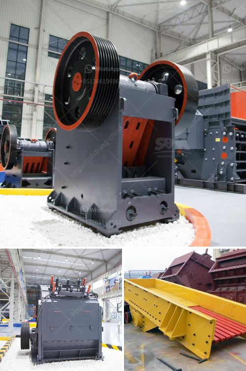

<h3>full crushing plants germiston</h3>
Germiston, a city located in Gauteng, South Africa, is renowned for its industrial prowess with a particular focus on the mining and construction sectors. In recent years, the demand for high-quality aggregates, such as sand, gravel, and crushed stone, has surged as infrastructure development projects continue to multiply both locally and regionally. As a result, the need for efficient full crushing plants has become increasingly critical for companies in Germiston and surrounding areas.

Full crushing plants, also known as complete crushing plants or aggregate production lines, are stationary or portable mining equipment used to crush and screen raw materials into specific sizes required for various construction and infrastructure projects. These plants combine different machines and equipment to crush, screen, wash, and stockpile aggregates efficiently and effectively.

1. Improved efficiency: Full crushing plants are designed to significantly improve production efficiency by eliminating the need for moving raw materials to various processing stages. Instead, these plants provide an all-in-one solution that integrates multiple processes, including feeding, crushing, screening, and even washing if necessary. This streamlined approach reduces labor requirements, minimizes material handling errors, and ultimately increases productivity.

2. Consistent product quality: By employing full crushing plants, companies in Germiston can ensure consistent product sizes and qualities. Advanced crushing and screening technology contribute to precision in material processing, which is particularly essential in meeting the strict specifications required for various construction applications. Consistent product quality not only enhances customer satisfaction but also strengthens the reputation of companies within the industry.

3. Cost-effectiveness: Full crushing plants can save companies time and money by eliminating the need for multiple machines and equipment, as well as the associated labor costs. Additionally, centralized crushing and screening processes reduce transportation expenses, as raw materials are processed on-site, minimizing the distance between the source and the final destination. Moreover, certain full crushing plant designs prioritize energy efficiency, resulting in lower operational costs and a reduced environmental footprint.

4. Versatility: Full crushing plants are adaptable to different raw material types and sizes, making them suitable for various applications. Whether it is producing aggregates for road construction, concrete production, or railway ballast, these plants can be customized to handle different materials, ensuring versatility, and maximizing plant utilization.

In Germiston and neighboring areas, where mining and construction activities thrive, the adoption of full crushing plants has become essential for companies aiming to stay competitive in the demanding aggregate production industry. These plants offer improved efficiency, consistent quality, cost-effectiveness, and versatility, making them a valuable asset for any company involved in supplying aggregates for infrastructure projects. By investing in modern full crushing plants, companies can meet the surge in demand for high-quality aggregates, contributing to the growth and development of the region's construction sector.
<h3>Contact us</h3><ul><li><strong>Whatsapp:&nbsp;<a href="https://wa.me/8613661969651">+8613661969651</a></strong></li><li><a href="https://swt.shibang-china.com/?git&amp;zhl&amp;full crushing plants germiston"><strong>Online Service(chat now)</strong></a></li></ul><h3>Related</h3><ul><li><a href='clinker grinding mill germany price.md'>clinker grinding mill germany price</a></li><li><a href='mobile crushing and screening plant.md'>mobile crushing and screening plant</a></li><li><a href='roller mill for sale kenya.md'>roller mill for sale kenya</a></li><li><a href='how to identify rear roll in the two roll mill.md'>how to identify rear roll in the two roll mill</a></li><li><a href='gold crusher and mill.md'>gold crusher and mill</a></li></ul>