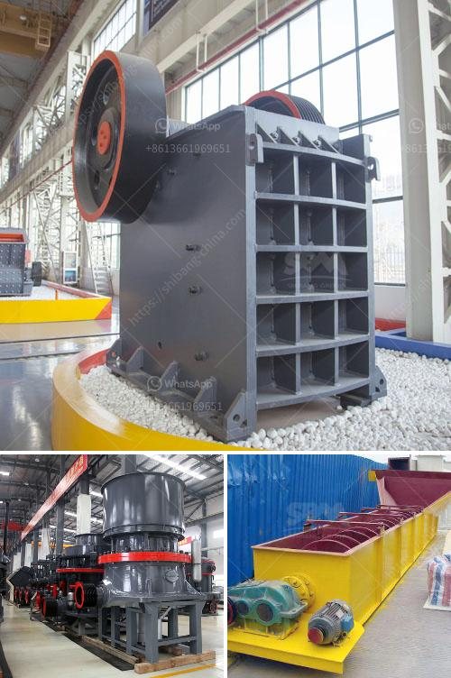

<h3>german crusher for sale</h3>
When it comes to collecting military memorabilia, German weaponry and equipment from World War II is highly sought after by collectors. One such item that is currently in high demand is the German crusher. This iconic piece of equipment was worn by German soldiers during the war and has since become a must-have for collectors around the world.

The German crusher is a type of hat that was worn by the military during World War II. Made from superior quality materials, it offered excellent protection for soldiers in the field. Its distinctive design featured a peak that could be folded down to provide extra protection from the elements. This also gave the crusher its distinctive "crushed" appearance, from which it got its name.

Collecting German crushers has become increasingly popular in recent years due to their historical significance and rarity. Owning an original German crusher can provide a glimpse into the past and honor the brave soldiers who fought in the war. Many collectors see these pieces as a way to preserve history and pay tribute to those who served.

Finding a genuine German crusher for sale can be a challenging task, as there are many replicas and fakes in the market. However, with thorough research and the help of reputable dealers, collectors can ensure they are purchasing an authentic piece. It’s essential to examine the materials, construction, and markings to determine its authenticity. Additionally, seeking the advice of experts or attending specialized military collectibles shows can provide valuable insights into identifying genuine German crushers.

The value of a German crusher can vary greatly depending on its condition, rarity, and historical significance. Some collectors prefer pristine, unused crushers, while others appreciate the wear and tear that comes with authentic pieces. Prices for these hats can range from a few hundred to several thousand dollars, depending on their desirability and market demand.

Apart from being an excellent addition to a military memorabilia collection, a German crusher also serves as a conversation starter. Displaying this unique piece of history can attract attention and allow collectors to educate others about the significance of these items. It is a tangible reminder of the sacrifices made by soldiers during the war and can spark discussions about the importance of remembering and honoring their legacy.

German crushers are not just valued for their historical significance but also for their quality craftsmanship. Made to withstand the rigors of warfare, they were built to last. Many collectors appreciate the attention to detail and the quality of materials used in their construction. This craftsmanship is a testament to the skill of German manufacturers during that time.

In conclusion, owning a genuine German crusher can be a valuable addition to any military memorabilia collection. Its historical significance, rarity, and quality craftsmanship make it highly sought after by collectors worldwide. Finding an authentic one may take time and effort, but the satisfaction of owning a piece of history is unparalleled. So, if you are an avid collector or a history enthusiast, don't miss out on the chance to add a German crusher to your collection.
<h3>Contact us</h3><ul><li><strong>Whatsapp:&nbsp;<a href="https://wa.me/8613661969651">+8613661969651</a></strong></li><li><a href="https://swt.shibang-china.com/?git&amp;zhl&amp;german crusher for sale"><strong>Online Service(chat now)</strong></a></li></ul><h3>Related</h3><ul><li><a href='crusher size 1 ton capacity hour.md'>crusher size 1 ton capacity hour</a></li><li><a href='calculating capacity of a roll crusher.md'>calculating capacity of a roll crusher</a></li><li><a href='ballast making machine kenya.md'>ballast making machine kenya</a></li><li><a href='jaw crushers in harare zimbabwe.md'>jaw crushers in harare zimbabwe</a></li><li><a href='counties roller mills.md'>counties roller mills</a></li></ul>