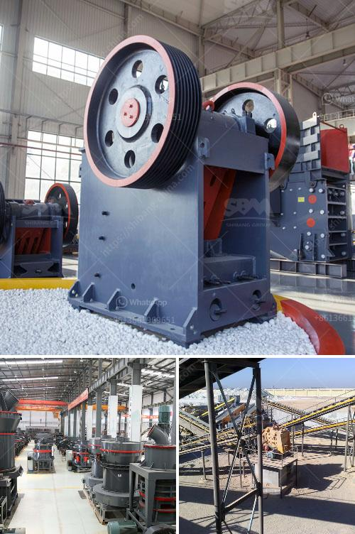

<h3>german made jaw crusher prices</h3>
German-made jaw crushers are leading worldwide suppliers of crushing equipment, boasting a strong reputation for delivering dependable and efficient machinery. Not only are these crushers built to last, but they also offer impressive performance capabilities that are ideal for mining, quarrying, and recycling applications.

The first thing to note about German-made jaw crushers is their robust construction. These machines are engineered to withstand the toughest applications and extreme conditions. High-quality materials are used in their manufacturing process, ensuring durability and longevity. German manufacturers pride themselves on their attention to detail, making sure each component is of the highest standard.

In addition to their durability, German-made jaw crushers are renowned for their excellent performance capabilities. The design of the crushing chamber and kinematics ensure a high crushing ratio, resulting in a consistent product size. This efficiency is crucial for various industries, where a well-graded end product is required.

Another important aspect to consider when discussing German jaw crusher prices is their versatility. These machines can handle a wide range of materials, from hard and abrasive rocks to softer materials like limestone or recycling materials. With various jaw plate options available, these crushers can be optimized for specific applications, providing excellent versatility on the job site.

Many German manufacturers also prioritize user-friendliness. Their jaw crushers are designed with the operator in mind, making maintenance and servicing simple and straightforward. This reduces downtime, optimizing productivity and minimizing costs. Additionally, safety features are incorporated to ensure the wellbeing of the operators, further enhancing the overall user experience.

German-made jaw crushers are known for their reliability. They are designed to consistently deliver high performance, even in challenging environments. The use of advanced technology and precision engineering guarantees that these crushers provide a consistent and efficient crushing process.

When it comes to pricing German-made jaw crushers, it's important to consider the overall value they offer. While the initial investment might be higher compared to cheaper alternatives, the long-term benefits are well worth it. The reliability, durability, performance, versatility, and user-friendliness of these machines make them a wise investment that can significantly improve productivity and profitability.

Ultimately, the decision regarding the purchase of a German-made jaw crusher should be based on the specific needs and requirements of the operation. Considering factors such as the application, desired output size, and budget will help determine if a German-made jaw crusher is the right choice.

In conclusion, German-made jaw crushers are renowned for their robust construction, excellent performance capabilities, versatility, and user-friendliness. While the initial investment might be higher, the long-term benefits and overall value make them a popular choice among industry professionals. The reputation of German manufacturers in delivering reliable and efficient crushing equipment further enhances their appeal. Whether in mining, quarrying, or recycling applications, German-made jaw crushers prove to be a wise investment that can significantly improve productivity and profitability.
<h3>Contact us</h3><ul><li><strong>Whatsapp:&nbsp;<a href="https://wa.me/8613661969651">+8613661969651</a></strong></li><li><a href="https://swt.shibang-china.com/?git&amp;zhl&amp;german made jaw crusher prices"><strong>Online Service(chat now)</strong></a></li></ul><h3>Related</h3><ul><li><a href='used gold washing machines.md'>used gold washing machines</a></li><li><a href='sand and gravel crushers machine.md'>sand and gravel crushers machine</a></li><li><a href='crusher plants in sri lanka.md'>crusher plants in sri lanka</a></li><li><a href='crusher business aggregate.md'>crusher business aggregate</a></li><li><a href='raymond used mill for sale used.md'>raymond used mill for sale used</a></li></ul>