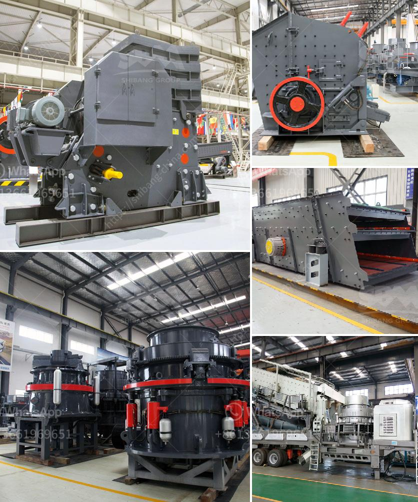

<h3>germany made gypsum block wall equipment</h3>
Germany has long been recognized globally for its engineering prowess and innovative technologies. One such groundbreaking development in the construction industry is Germany's Gypsum Block Wall Equipment. With superior quality, efficiency, and sustainability, this equipment is revolutionizing the way buildings are constructed, setting new benchmarks for excellence in the global construction sector.

The gypsum block wall equipment manufactured in Germany is designed to streamline the construction process significantly. Traditional building methods often involve several steps, such as mixing and pouring concrete, block by block, along with extensive curing time. In contrast, the equipment automates and accelerates these processes, leading to faster construction times and increased overall efficiency.

Manufacturing gypsum blocks using automated equipment means that the wall sections can be prefabricated off-site and then transported to the construction site. This approach significantly reduces construction time, eliminates the need for on-site concrete mixing, and minimizes disruptions caused by noise and dust. Moreover, the precise design and manufacturing capabilities of the German equipment allow for quick installation, with each block fitting seamlessly into the overall structure.

The German Gypsum Block Wall Equipment ensures consistently high-quality constructions. The automated production process guarantees accurate dimensions and uniformity, resulting in walls that are free from irregularities and imperfections, leading to higher quality buildings.

Furthermore, the equipment enables the production of gypsum blocks at a considerably lower cost compared to traditional construction techniques. The prefabrication and automation of the manufacturing process contribute to reducing labor costs and minimizing material wastage. Additionally, the design of the gypsum blocks allows for improved insulation properties, which can reduce long-term energy costs for the building's occupants.

Germany's gypsum block wall equipment aligns with the country's focus on environmental sustainability. The manufacturing process generates minimal waste, as it uses sustainable materials and efficient technologies. Gypsum blocks are made from natural gypsum, a readily available and reusable resource. By opting for gypsum blocks over conventional materials, builders can contribute to reducing the industry's carbon footprint and overall environmental impact.

Moreover, gypsum blocks have excellent fire resistance properties, providing an added layer of safety to the building. This durability and safety contribute to the long lifespan of the construction, reducing the need for frequent repairs and rebuilding, and contributing to the overall sustainable development goals.

Germany's Gypsum Block Wall Equipment is a game-changer for the global construction industry. Combining efficiency, speed, superior quality, and sustainability, it allows for faster construction times, while also reducing costs and environmental impact. As builders around the world recognize the advantages of this technology, it is anticipated that Germany's gypsum block wall equipment will continue to shape the future of construction, setting new standards for efficiency and eco-friendly practices.
<h3>Contact us</h3><ul><li><strong>Whatsapp:&nbsp;<a href="https://wa.me/8613661969651">+8613661969651</a></strong></li><li><a href="https://swt.shibang-china.com/?git&amp;zhl&amp;germany made gypsum block wall equipment"><strong>Online Service(chat now)</strong></a></li></ul><h3>Related</h3><ul><li><a href='mobile diamond washing plant for sale.md'>mobile diamond washing plant for sale</a></li><li><a href='ouedkniss station concassage.md'>ouedkniss station concassage</a></li><li><a href='gold corporation ball mill.md'>gold corporation ball mill</a></li><li><a href='mining machinery companies in germany.md'>mining machinery companies in germany</a></li><li><a href='mobile cone crushing station for sale.md'>mobile cone crushing station for sale</a></li></ul>