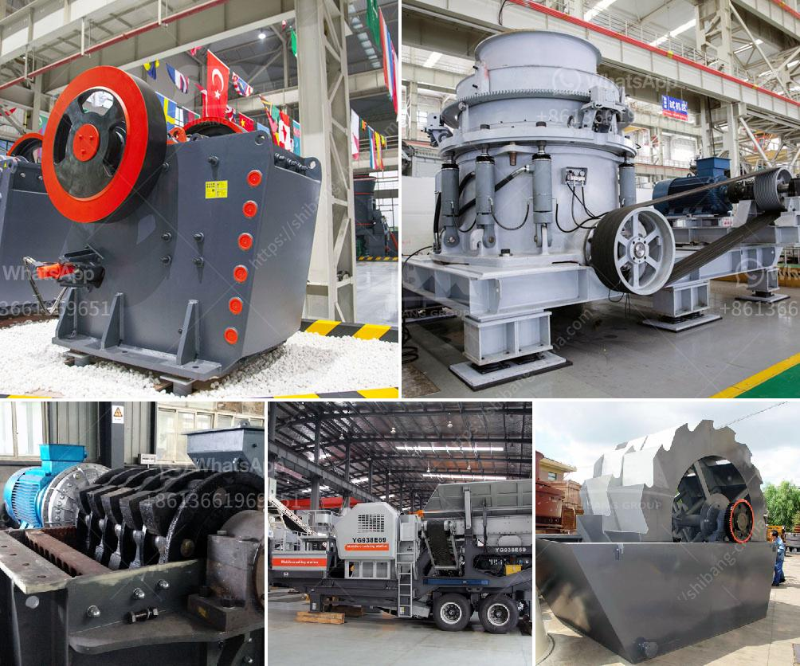

<h3>gold corporation ball mill</h3>
Mining is a vital industry that plays a significant role in the global economy. However, it is also recognized as one of the most environmentally damaging sectors due to its resource-intensive nature. To address this concern, the Gold Corporation has developed an innovative solution – the Gold Corporation Ball Mill.

A ball mill is a type of grinder used to grind materials into extremely fine powder for use in mineral dressing processes, paints, pyrotechnics, ceramics, and selective laser sintering. The Gold Corporation Ball Mill is no ordinary mill; instead, it relies on advanced technology and expertise to ensure sustainable mining practices.

One of the key features of the Gold Corporation Ball Mill is its energy-efficient design. It utilizes a rotating cylindrical container filled with metal balls that grind the material to the desired fineness. By optimizing the rotation speed and ball size, the mill minimizes energy consumption while maximizing productivity.

Furthermore, the Gold Corporation Ball Mill adopts a closed-loop system that recycles water and reduces overall water consumption. This not only saves precious resources but also helps prevent environmental pollution by minimizing the discharge of harmful wastewater.

Moreover, the Gold Corporation Ball Mill is equipped with advanced safety mechanisms to protect workers and minimize accidents. These include sensors that monitor temperature, pressure, and vibration levels to detect any abnormalities and automatically shut down the mill if necessary.

Beyond its technological features, the Gold Corporation Ball Mill is a testament to the company's commitment to sustainable mining practices. It is manufactured using eco-friendly materials and processes, ensuring minimal environmental impact during its production and operation.

In conclusion, the Gold Corporation Ball Mill represents a significant step towards sustainable mining practices. With its energy-efficient design, closed-loop water system, advanced safety mechanisms, and eco-friendly manufacturing, it is a game-changer in the mining industry. By adopting this innovative solution, mining companies can reduce their environmental footprint while maximizing productivity and profitability.
<h3>Contact us</h3><ul><li><strong>Whatsapp:&nbsp;<a href="https://wa.me/8613661969651">+8613661969651</a></strong></li><li><a href="https://swt.shibang-china.com/?git&amp;zhl&amp;gold corporation ball mill"><strong>Online Service(chat now)</strong></a></li></ul><h3>Related</h3><ul><li><a href='silica sand price per ton.md'>silica sand price per ton</a></li><li><a href='limestone grinding machine.md'>limestone grinding machine</a></li><li><a href='calcium carbonate milling plant in turkey.md'>calcium carbonate milling plant in turkey</a></li><li><a href='roller mill spaider.md'>roller mill spaider</a></li><li><a href='dry process for gold recovery.md'>dry process for gold recovery</a></li></ul>