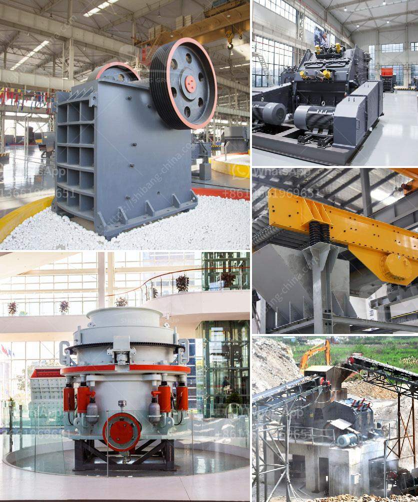

<h3>gold crusher and mill</h3>
Mining is an essential sector for economic growth and development worldwide. The extraction of valuable minerals and other geological materials from the earth provides numerous opportunities for groundbreaking technological advancements, investments, and employment. Among the various minerals extracted, gold holds a prominent position. Its allure has captivated people since ancient times, and its value has only increased with time. To extract gold from the earth efficiently and effectively, a gold crusher and mill play an indispensable role.

A gold crusher is a machine used to crush large gold-bearing rocks into smaller pieces, enabling gold to be extracted from the rocks more easily and efficiently. It is a vital tool to effectively separate gold particles from gangue minerals to achieve the desired end product for further processing. In addition to crushing rocks, gold crushers also enable the recovery of other valuable minerals mixed in the ore, maximizing the mining operation's overall profitability.

Similarly, a gold mill serves a crucial purpose in the gold mining industry. It grinds gold-bearing rocks or ore to release the target mineral and separate it from the surrounding waste materials. The crushed material is then further processed, typically through cyanidation or other specialized techniques, to extract the gold. A gold mill ensures efficient gold recovery, saving time and resources for mining companies while also meeting environmental and safety regulations.

The advancements in gold crusher and mill technology have enhanced the efficiency and productivity of gold mining operations. Modern crushing and grinding equipment not only improves the extraction process but also reduces energy consumption, increases overall operation capacity, and minimizes maintenance costs. Automation and remote monitoring systems further optimize the process, ensuring the safety and well-being of mining personnel.

Furthermore, innovation in gold crusher and mill design has made them more mobile and compact, allowing mining operations to be more flexible and adaptable. Portable gold crushers and mills enable companies to access remote or hard-to-reach areas where abundant gold deposits may exist. This mobility also makes it easier to relocate crushing and grinding equipment as mining sites evolve or deplete.

The significance of gold crushers and mills extends beyond their extraction capabilities. The mining industry is an essential source of revenue for many countries, generating jobs and contributing to economic growth. Investments in gold mining operations, including crushers and mills, not only drive the local economy but also promote infrastructure development and technology transfer.

It is important to note that responsible and sustainable mining practices must always be upheld in gold extraction. Mining companies must ensure that their operations adhere to environmental regulations, implement proper waste management processes, and prioritize the safety and well-being of their workers. The increased efficiency and productivity brought by advanced gold crushers and mills should be complemented by a commitment to responsible mining practices.

In conclusion, gold crushers and mills are integral to the mining industry, enabling the extraction of this precious metal from the earth. From ancient civilizations to modern times, gold has remained a symbol of wealth and prosperity. The development and advancement of gold crusher and mill technology have revolutionized the extraction process, making it more efficient, environmentally friendly, and economically viable. As the demand for gold continues to grow, it is crucial to embrace innovative solutions while adhering to responsible mining practices.
<h3>Contact us</h3><ul><li><strong>Whatsapp:&nbsp;<a href="https://wa.me/8613661969651">+8613661969651</a></strong></li><li><a href="https://swt.shibang-china.com/?git&amp;zhl&amp;gold crusher and mill"><strong>Online Service(chat now)</strong></a></li></ul><h3>Related</h3><ul><li><a href='vertical impact crusher.md'>vertical impact crusher</a></li><li><a href='processing of copper crusher.md'>processing of copper crusher</a></li><li><a href='counties roller mills.md'>counties roller mills</a></li><li><a href='small gravel crusher machine ethiopia.md'>small gravel crusher machine ethiopia</a></li><li><a href='stones crushing into building sand.md'>stones crushing into building sand</a></li></ul>