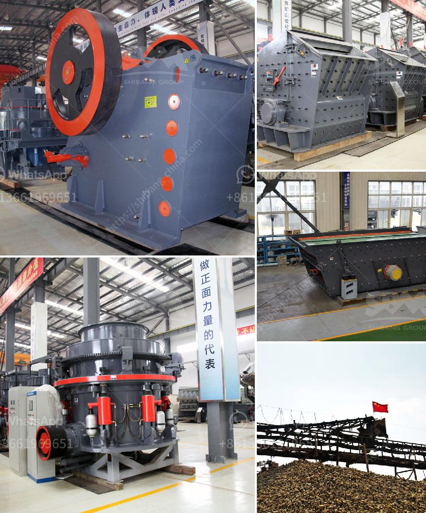

<h3>gold crusher cost</h3>
Gold has always been, and continues to be, a highly valuable and sought-after precious metal. Its unique properties and stability have made it a symbol of wealth and a store of value for centuries. As such, the gold mining industry plays a crucial role in the global economy.

In recent years, the rising demand for gold has led to an increase in gold mining activities worldwide. One essential aspect of this industry is the gold crusher, which is used to break down large chunks of gold-bearing ore into smaller, more manageable pieces. But how much does a gold crusher cost?

The cost of a gold crusher can vary depending on various factors, including the type and size of the crusher, the capacity it can handle, the efficiency and technology employed, and the location of the supplier or manufacturer. However, one must understand that the cost of a gold crusher goes well beyond the purchase price.

When considering the cost of a gold crusher, one must take into account not only the initial investment but also the operational costs and maintenance requirements. These ongoing expenses can significantly impact the overall cost of the crusher over its lifespan.

Operational costs include factors such as fuel consumption, electricity usage, and labor costs. The efficiency and design of the crusher can greatly affect these expenses. A more efficient crusher will require less energy to operate, resulting in reduced operational costs. Additionally, a crusher designed for ease of maintenance and repairs can minimize downtime and overall maintenance costs.

Another crucial aspect to consider when evaluating the cost of a gold crusher is its productivity and throughput. A crusher with higher processing capacity can handle larger volumes of ore per hour, leading to increased gold recovery and potentially higher profits for the gold mine. However, this higher capacity often comes with a higher initial investment.

The location of the supplier or manufacturer can also impact the cost of a gold crusher. Shipping costs and import taxes can add a significant amount to the overall cost, especially if the crusher needs to be transported over long distances.

To determine the true value of a gold crusher, it is crucial to consider not only its purchase price but also its operational efficiency, maintenance requirements, throughput capacity, and location of the supplier. Opting for a high-quality crusher with a higher initial investment might result in long-term cost savings through improved efficiency and reduced maintenance expenses.

Moreover, investing in a reputable and reliable supplier with a strong track record in the industry can provide peace of mind and minimize the risk of unexpected maintenance issues or inefficiencies.

In conclusion, the cost of a gold crusher extends beyond the purchase price. By considering factors such as operational costs, efficiency, maintenance requirements, throughput capacity, and location, one can evaluate the true value of a gold crusher. Investing in a high-quality crusher from a reputable supplier can lead to long-term cost savings and increased profitability for gold mining operations.
<h3>Contact us</h3><ul><li><strong>Whatsapp:&nbsp;<a href="https://wa.me/8613661969651">+8613661969651</a></strong></li><li><a href="https://swt.shibang-china.com/?git&amp;zhl&amp;gold crusher cost"><strong>Online Service(chat now)</strong></a></li></ul><h3>Related</h3><ul><li><a href='vertical roller mill for cement grinding.md'>vertical roller mill for cement grinding</a></li><li><a href='mobile crusher in the coal mining.md'>mobile crusher in the coal mining</a></li><li><a href='lime stone crusher with capacity.md'>lime stone crusher with capacity</a></li><li><a href='price of stone crusher stone crusher.md'>price of stone crusher stone crusher</a></li><li><a href='used raymond mill for sale in india.md'>used raymond mill for sale in india</a></li></ul>