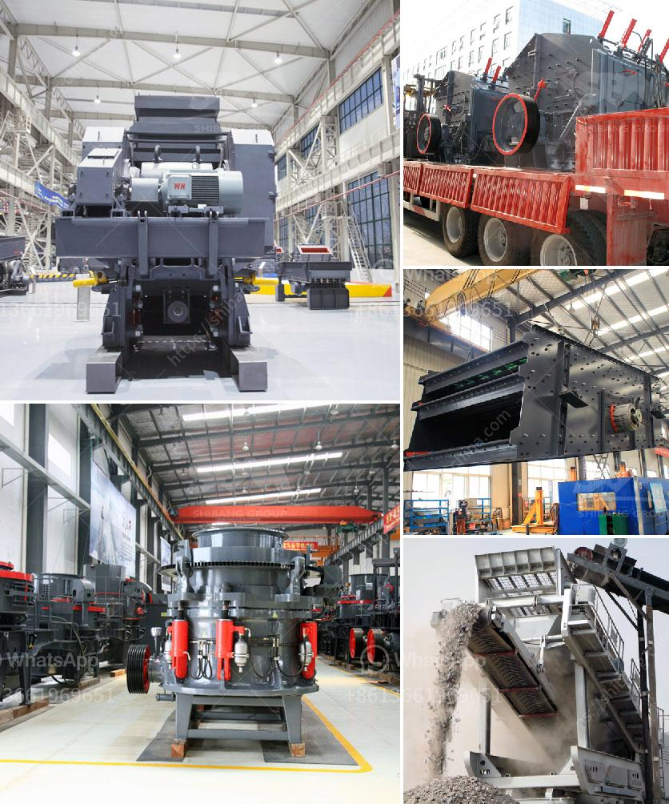

<h3>gold crushing machine</h3>
Gold ore crushing process includes primary crushing and secondary crushing, also known as gold milling machine. 

Gold ore crushing machine is used to crush gold ore into smaller particles. within the gold ore coarse crushing process, jaw crusher is used as gold ore primary crusher. After coarse crushing process, screen out the fine gold ore, the gild ore with diameter more than 10 mm go through secondary crushing process, in this crushing process, standard CS series cone crusher is used. In some large gold concentrator, there is fine crushing process after secondary crushing. In this fine crushing, short-head CS series cone crusher is used as gold ore crushing machine.

The crushed gold ore enter into ball mill evenly through vibrating screen. Ball mill is essential gold ore beneficiation machine used to grind gold ore into powder less than 200 mesh. Gold ore powder go through classification and flotation to make pure gold. According to the different requirements, we can disign gold ore mining process flow chart for the gold mine.

Most gold ore processing relies on cyanide leaching to extract gold from the ore. The gold-bearing cyanide solution is then concentrated and the gold is recovered and further purified, if gold ore contains mercury, air emissions from ore processing may occur under certain physical and chemical conditions.

Now you can use gold ore crushing machine at work. By gold ore crushing machine is small to medium-sized business to invest in the choice. For example: Gold will be able to customize a suitable beneficiation process taking into account factors such as industrial scale, climate and terrain.

Gold ore crushing machine production line: gold mine is usually a small to medium-sized business to choose investment. Gold ore crusher and then delivered to the subsequent fine ore crushing, and ball mill grinding wet pan mill. Re-election in the rock gold mine and more as an auxiliary production, in the grinding process to recover coarse gold, and create favorable conditions for flotation and cyanidation processes improve beneficiation indicators, and then gold recovery operations can be performed by the cyanidation plant.
<h3>Contact us</h3><ul><li><strong>Whatsapp:&nbsp;<a href="https://wa.me/8613661969651">+8613661969651</a></strong></li><li><a href="https://swt.shibang-china.com/?git&amp;zhl&amp;gold crushing machine"><strong>Online Service(chat now)</strong></a></li></ul><h3>Related</h3><ul><li><a href='logo of stone crusher.md'>logo of stone crusher</a></li><li><a href='mobile cone crusher for sale.md'>mobile cone crusher for sale</a></li><li><a href='aggregates crushing plant in angat bulacan.md'>aggregates crushing plant in angat bulacan</a></li><li><a href='vertical mill for slag grinding.md'>vertical mill for slag grinding</a></li><li><a href='mobile crushing and screening plants.md'>mobile crushing and screening plants</a></li></ul>