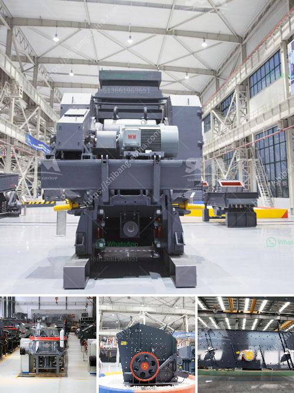

<h3>gold hammer mill used for sale in zimbabwe</h3>
The gold hammer mill is an essential piece of equipment for anyone looking to establish a successful small-scale gold mining operation in Zimbabwe. The hammer mill is a type of grinding mill that crushes the material into smaller particles, which is then processed by the gold processing plant.

The gold hammer mill operates on a 3 phase motor, capable of producing high-quality crushed particles. The gold ore is fed into the hopper, which is then sent through a conveyor belt to the hammer mill. The material is ground by the high-speed rotating hammer heads and then discharged through a screen to obtain the desired particle size.

One of the major advantages of using a gold hammer mill is its low cost. These mills are relatively inexpensive to purchase and maintain, making them a cost-effective solution for small-scale miners. Additionally, the gold hammer mill is highly portable and can be easily transported to the mining site, where it can be used on a variety of ore types with minimal setup and operating costs.

Another advantage of using a gold hammer mill is its versatility. The mill can be used to crush and pulverize a wide range of materials, including gold ore, rock, stone, coal, concrete, limestone, wood chips, and more. This flexibility allows miners to process different types of ore and maximize their gold recovery.

In Zimbabwe, artisanal and small-scale gold mining has been on the rise due to the economic hardships and the lack of formal employment opportunities. The gold hammer mill offers a sustainable solution to these miners, both in terms of income generation and gold recovery. With a gold hammer mill, small-scale miners can avoid the use of harmful mercury in their gold recovery process, significantly reducing their environmental impact.

When purchasing a gold hammer mill for sale in Zimbabwe, small-scale miners should consider several factors. First and foremost, they should ensure that the equipment is in good working condition and capable of efficiently processing the desired material. It is also important to consider the size and capacity of the mill to ensure it meets the specific needs of the mining operation.

Furthermore, small-scale miners should also prioritize safety when operating the gold hammer mill. Proper training should be provided, and safety protocols should be followed to prevent accidents and injuries. Miners should also wear protective gear, such as helmets, gloves, and goggles, to ensure their safety at all times.

In conclusion, the gold hammer mill is a cost-effective and versatile piece of equipment that offers small-scale miners the opportunity to produce high-quality crushed particles and maximize their gold recovery. With its low cost, portability, and flexibility, the gold hammer mill is an essential tool for small-scale gold mining operations in Zimbabwe. However, it is crucial to prioritize safety and ensure that the equipment is in good working condition before making a purchase.
<h3>Contact us</h3><ul><li><strong>Whatsapp:&nbsp;<a href="https://wa.me/8613661969651">+8613661969651</a></strong></li><li><a href="https://swt.shibang-china.com/?git&amp;zhl&amp;gold hammer mill used for sale in zimbabwe"><strong>Online Service(chat now)</strong></a></li></ul><h3>Related</h3><ul><li><a href='silicon ore processing equipment.md'>silicon ore processing equipment</a></li><li><a href='second hand raymond mill in india.md'>second hand raymond mill in india</a></li><li><a href='mobile dimension stone processing dressing cutting.md'>mobile dimension stone processing dressing cutting</a></li><li><a href='pe jaw crusher price list.md'>pe jaw crusher price list</a></li><li><a href='rock crusher for excavator.md'>rock crusher for excavator</a></li></ul>