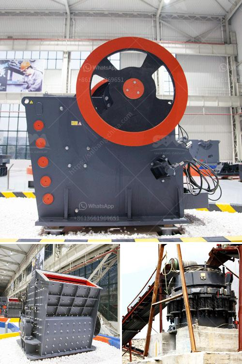

<h3>gold hammer mill used forr sale in zimbabwe</h3>
If you are in the mining industry, chances are you have come across the term "gold hammer mill." This equipment is a fundamental component for processing gold ores efficiently and effectively. It is widely used in gold mining, whether it is in Zimbabwe or any other country worldwide.

A gold hammer mill works by crushing gold ore into small particles. The hammer mill rotates at high speed, crushing and grinding the ore until it is small enough to pass through the screen at the bottom of the crusher. This process is faster and more efficient than traditional methods, which relied on the gravitational force to separate the gold from the ore.

In Zimbabwe, artisanal and small-scale miners have significantly contributed to the country's gold production. They rely on equipment such as gold hammer mills to process their gold ores efficiently and at a low cost. In addition to gold hammer mills, other gold ore processing equipment is also used, such as amalgamation barrels and shaking tables.

If you are in the mining industry in Zimbabwe and looking for a gold hammer mill, you are in luck. There are numerous suppliers and manufacturers in the country that offer this equipment for sale at affordable prices. These mills come in different sizes, depending on the scale of your mining operation. Some can process small quantities of ore, while others are more suitable for larger-scale operations.

When purchasing a gold hammer mill, it is crucial to consider factors such as the durability and efficiency of the equipment. Additionally, it is important to ensure that you are buying from a reputable supplier who offers after-sales support and spare parts. This will save you from any potential downtime and ensure that your operations run smoothly.

In conclusion, a gold hammer mill is an essential piece of equipment for any mining operation, particularly in Zimbabwe. It helps miners process their gold ores efficiently and at a low cost. When looking for a gold hammer mill for sale, there are multiple suppliers and manufacturers in Zimbabwe to choose from. Just ensure that you consider factors such as durability, efficiency, after-sales support, and spare parts availability to make the best purchase for your mining operation.
<h3>Contact us</h3><ul><li><strong>Whatsapp:&nbsp;<a href="https://wa.me/8613661969651">+8613661969651</a></strong></li><li><a href="https://swt.shibang-china.com/?git&amp;zhl&amp;gold hammer mill used forr sale in zimbabwe"><strong>Online Service(chat now)</strong></a></li></ul><h3>Related</h3><ul><li><a href='crusher for sale in kerala.md'>crusher for sale in kerala</a></li><li><a href='puzolana 250 tph crusher.md'>puzolana 250 tph crusher</a></li><li><a href='ball mill for sale.md'>ball mill for sale</a></li><li><a href='mobile dimension stone processing dressing cutting.md'>mobile dimension stone processing dressing cutting</a></li><li><a href='hammer mill manufacturer in tamilnadu.md'>hammer mill manufacturer in tamilnadu</a></li></ul>