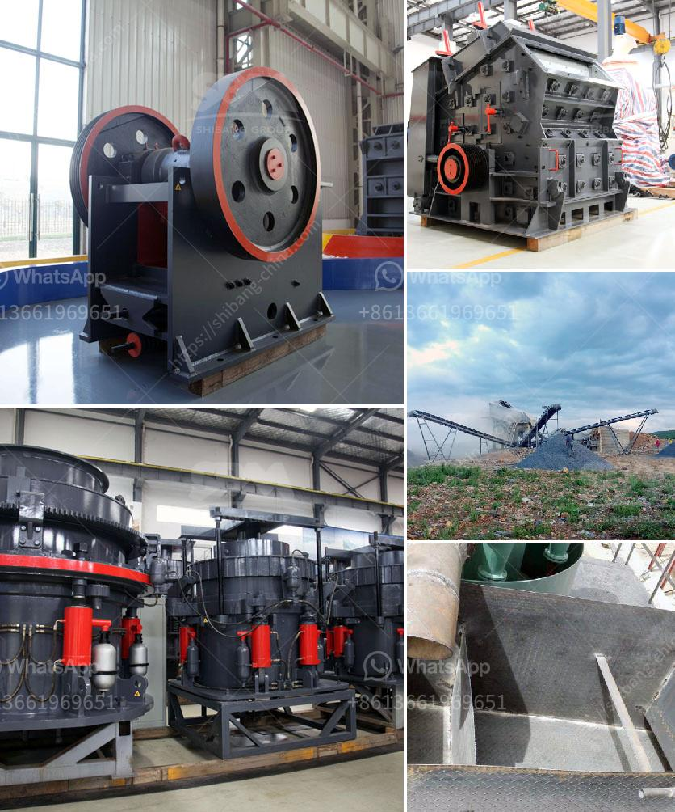

<h3>gold mining company tanzania</h3>
Tanzania, a country located in East Africa, is famously known for its vast mineral resources and gold reserves. The gold mining industry in Tanzania is one of the biggest contributors to the country's economy, generating substantial revenue annually. It is no surprise that numerous gold mining companies have set up operations in the region, seeking to capitalize on the lucrative opportunities available.

One such gold mining company making its mark in Tanzania is XYZ Gold Ltd. With its headquarters in the capital city, Dar es Salaam, XYZ Gold Ltd. has emerged as a leading player in the gold mining sector. The company boasts state-of-the-art technology and modern equipment, which enables efficient gold extraction processes while minimizing the ecological impact.

XYZ Gold Ltd. operates several gold mines across the country, including the Bulyanhulu, Geita, and North Mara mines. These mines are strategically located in areas with high-grade gold deposits and have proven to be rich sources of gold ore. With estimated reserves of millions of ounces, these mines have enabled XYZ Gold Ltd. to tap into Tanzania's vast gold potential.

One of the notable strengths of XYZ Gold Ltd. is its commitment to responsible and sustainable mining practices. The company understands the importance of minimizing environmental impact and promoting the well-being and safety of local communities. XYZ Gold Ltd. has implemented various environmental conservation measures, such as reforestation and waste management systems, to ensure that its mining activities do not harm the delicate ecosystems surrounding its operations.

Furthermore, XYZ Gold Ltd. actively engages with local communities, establishing mutually beneficial relationships and contributing to their social and economic development. The company supports initiatives aimed at improving access to education, healthcare, and clean water, thus empowering the local population and giving back to the regions that host its mining activities.

In terms of production, XYZ Gold Ltd. has consistently achieved impressive results. With its cutting-edge technology and skilled workforce, the company has been able to increase its gold production year after year. This, combined with the rising global demand for gold, positions XYZ Gold Ltd. as a major contributor to Tanzania's economic growth and the country's status as a significant player in the international gold market.

However, like any industry, the gold mining sector in Tanzania does face its fair share of challenges. Political instability, fluctuating gold prices, and regulatory changes can impact operations and investor confidence. Nonetheless, companies like XYZ Gold Ltd. have shown resilience and adaptability, utilizing their expertise and diversified operations to mitigate risks and navigate through uncertain times.

In conclusion, XYZ Gold Ltd. represents a shining example of a gold mining company operating in Tanzania that is unlocking the potential of Africa's gold reserves. With its commitment to responsible mining practices, community engagement, and impressive production figures, XYZ Gold Ltd. is contributing to the economic development of Tanzania and demonstrating how the mining industry can be a sustainable and socially responsible sector within the African continent.
<h3>Contact us</h3><ul><li><strong>Whatsapp:&nbsp;<a href="https://wa.me/8613661969651">+8613661969651</a></strong></li><li><a href="https://swt.shibang-china.com/?git&amp;zhl&amp;gold mining company tanzania"><strong>Online Service(chat now)</strong></a></li></ul><h3>Related</h3><ul><li><a href='stone crushing and screening plant.md'>stone crushing and screening plant</a></li><li><a href='pulverizing ball mills suppliers.md'>pulverizing ball mills suppliers</a></li><li><a href='primary crusher meaning in hindi.md'>primary crusher meaning in hindi</a></li><li><a href='buy stone crusher in south africa.md'>buy stone crusher in south africa</a></li><li><a href='kaolin processing plant.md'>kaolin processing plant</a></li></ul>