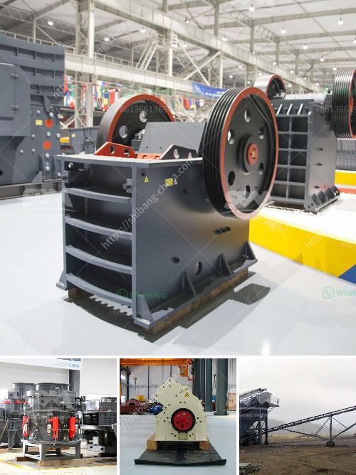

<h3>gold mining equipment from japan</h3>
Gold mining has been a significant industry throughout history, as the precious metal has been highly valued for its beauty and rarity. Over the years, various countries have played a crucial role in mining gold, with Japan being one of them. Japan has a rich history of gold mining, and its expertise in gold mining equipment is highly regarded worldwide.

Japanese mining techniques can be traced back to the 12th century when the Emperor ordered gold to be extracted from the sediment of local rivers. These early mining techniques involved hand tools and simple machines. However, as the demand for gold grew, so did the need for more advanced equipment.

One of the significant contributions of Japan to the gold mining industry is the development of efficient and high-quality mining equipment. Japanese manufacturers have invested heavily in research and development, constantly improving and innovating equipment to maximize productivity and minimize environmental impact.

Today, Japanese gold mining equipment is known for its innovation, reliability, and durability. Manufacturers produce a wide range of equipment, suitable for various mining methods and conditions. One of the most commonly used equipment is the gold dredge. This machine efficiently extracts gold from riverbeds, using powerful suction pumps and sluice boxes to separate the gold-bearing sediment from the rest of the material.

Another essential equipment in gold mining is the trommel. This cylindrical drum-like machine is designed to separate different-sized materials, such as rocks and gravel, from the gold particles. The rotating drum allows the smaller particles to pass through the holes, while larger materials are carried away, ensuring efficient gold recovery.

Japanese manufacturers have also developed advanced equipment for underwater gold mining. Remotely operated vehicles (ROVs) equipped with specialized cutting and suction tools are used to extract gold from deep-sea deposits. These ROVs can operate at great depths and are essential for mining gold in challenging underwater conditions.

Furthermore, Japan is at the forefront of developing environmentally friendly gold mining equipment. With growing awareness of the need to protect the environment, Japanese manufacturers have focused on developing equipment that minimizes the use of harmful chemicals and reduces carbon emissions. For example, they have designed innovative gold recovery systems that use water and gravity instead of mercury, a toxic substance commonly used in small-scale gold mining.

Japan's expertise in gold mining equipment extends beyond manufacturing. The country also has a rich history of successful gold mine operations. Japanese mining companies have utilized advanced equipment to extract gold efficiently from various mining sites across the globe. Their experience and knowledge gained from operating these mines have greatly influenced the design and development of gold mining equipment.

In conclusion, Japan has made significant contributions to the gold mining industry, particularly in the field of equipment manufacturing. Japanese manufacturers are known for their innovative and reliable machines that maximize productivity while minimizing environmental impact. Moreover, their expertise in operating gold mines has greatly influenced the development of efficient equipment. As the demand for gold continues to rise, the gold mining equipment from Japan will play a crucial role in meeting the industry's needs.
<h3>Contact us</h3><ul><li><strong>Whatsapp:&nbsp;<a href="https://wa.me/8613661969651">+8613661969651</a></strong></li><li><a href="https://swt.shibang-china.com/?git&amp;zhl&amp;gold mining equipment from japan"><strong>Online Service(chat now)</strong></a></li></ul><h3>Related</h3><ul><li><a href='crusher primary cone crusher.md'>crusher primary cone crusher</a></li><li><a href='granite mining machinery.md'>granite mining machinery</a></li><li><a href='50tpd mini cement plant cost in india.md'>50tpd mini cement plant cost in india</a></li><li><a href='cement plant machinery manufacturers.md'>cement plant machinery manufacturers</a></li><li><a href='quartz powder mining mill.md'>quartz powder mining mill</a></li></ul>