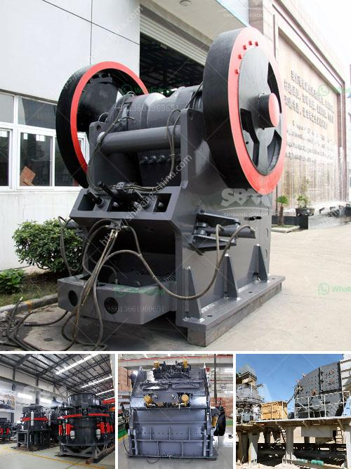

<h3>gold mining equipment in south africa for sale</h3>
Gold mining has been a vital industry in South Africa for centuries, providing the necessary raw materials for jewelry, electronics, and industrial applications. With more than 11% of the world's gold reserves, South Africa is home to the largest gold deposits found anywhere on Earth. From the Witwatersrand Basin to the Barberton Greenstone Belt, South Africa's gold fields contain some of the most productive and lucrative gold mines in the world.

To efficiently extract gold from these rich deposits, miners rely on specialized equipment. And when it comes to mining equipment, South Africa boasts some of the most advanced and widely used machinery in the world. From drilling rigs and excavators to crushing and grinding equipment, the mining industry employs a wide range of heavy machinery to extract and process gold.

One of the essential pieces of equipment in gold mining is the vibrating table. Vibrating tables are mainly used for the separation of fine particles based on their specific gravity. The particles are fed onto a vibrating deck with riffles, and the table vibrates back and forth, causing the material to stratify based on their specific gravity. This allows gold particles to settle at the bottom while lighter materials are carried off by the water flow. Vibrating tables are efficient and cost-effective tools for gold miners as they maximize the recovery of gold particles.

Another crucial piece of equipment in gold mining is the gold smelting furnace. Gold smelting furnaces are used to heat the gold-bearing rocks or concentrates at high temperatures, melting them into a pure gold bullion. These furnaces typically use heat generated by burning fuel, such as propane or natural gas, to produce the high temperatures required for smelting. Gold smelting furnaces come in various sizes, depending on the scale of the mining operation, and can process varying amounts of material at a time.

Drilling rigs are also indispensable in the gold mining industry. These powerful machines are used to explore and extract gold from beneath the ground. Using drill bits and advanced drilling techniques, miners can drill deep into the earth's crust to access gold-rich veins and deposits. The extracted core samples are then analyzed to determine the quality and quantity of gold present. Drill rigs range in size and capability, from small portable models used in artisanal mining to large, heavy-duty rigs used in industrial operations.

Besides these primary equipment, gold miners also rely on various auxiliary machinery to facilitate the extraction process. This includes crushers, grinders, and pulverizers to reduce the size of the extracted rock, water pumps to provide water supply to the mining site, and conveyors to transport the mined materials.

If you are looking to start or expand your gold mining operations in South Africa, various equipment suppliers offer a wide range of mining machinery suitable for different sizes and types of operations. From new to used machinery, you can find gold mining equipment for sale that meets your specific requirements and budget. Whether you are a small-scale artisanal miner or a large-scale industrial operation, investing in the right equipment can significantly enhance your mining efficiency and profitability in South Africa's gold-rich fields.
<h3>Contact us</h3><ul><li><strong>Whatsapp:&nbsp;<a href="https://wa.me/8613661969651">+8613661969651</a></strong></li><li><a href="https://swt.shibang-china.com/?git&amp;zhl&amp;gold mining equipment in south africa for sale"><strong>Online Service(chat now)</strong></a></li></ul><h3>Related</h3><ul><li><a href='gypsum chromium limestone mining.md'>gypsum chromium limestone mining</a></li><li><a href='limestone grinding machine.md'>limestone grinding machine</a></li><li><a href='impact crusher mesh.md'>impact crusher mesh</a></li><li><a href='basalt processing line.md'>basalt processing line</a></li><li><a href='price of roller mill machine.md'>price of roller mill machine</a></li></ul>