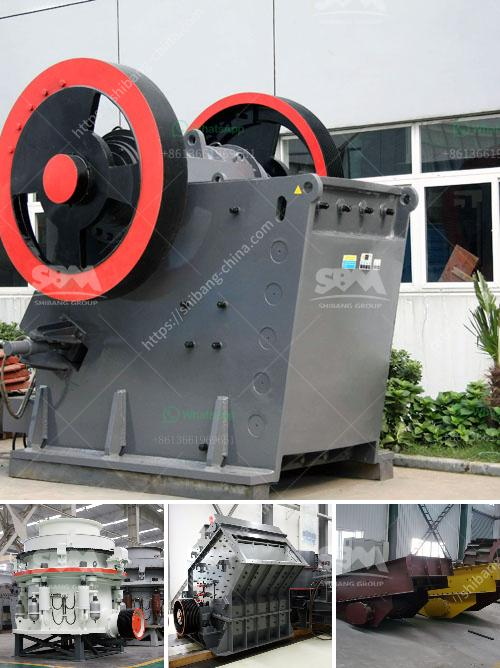

<h3>gold mining equipment manufacturers in china</h3>
Gold mining in China has been a lucrative business for quite some time now, and it is no surprise that the country has consistently been one of the world's leading gold producers. With a rich history of both small-scale and large-scale gold mining, China's gold mining industry has evolved significantly over the years.

One of the key factors contributing to the success of gold mining in China is the availability of state-of-the-art equipment. As the demand for gold continues to rise, so does the need for efficient and reliable mining equipment. This has led to the rapid growth of gold mining equipment manufacturers in China.

Chinese-made mining equipment has gained a significant share of the global market, as its low-cost and high-performance features have made it popular among mining companies worldwide. From extraction to refining, Chinese manufacturers offer a wide range of equipment tailored to suit various gold mining operations.

One of the leading gold mining equipment manufacturers in China is called Henan Hongxing Mining Machinery Co. Ltd. With a production capacity of 3-110t/h and 12-month warranty, this China-based company offers various mining equipment ranging from crushers and grinders to magnetic separators and flotation machines. Their extensive product portfolio ensures that mining companies have access to all the necessary equipment under one roof.

Another prominent name in the industry is Jiangxi Hengcheng Mining Equipment Co. Ltd, based in Ganzhou, Jiangxi Province. They specialize in manufacturing and supplying a diverse range of mining equipment, including gold concentrators, shaking tables, and slurry pumps. With ISO9001:2015 certification and 2-year warranty, their equipment is known for its durability and efficiency.

Additionally, Shandong Sinolinking Import & Export Co. Ltd is a reputable Chinese manufacturer that prides itself on providing innovative and high-quality equipment. Their gold mining machinery includes various kinds of trommels, gold dredges, gold concentrators, and gold washing plants. With a team of experienced engineers, they offer customized solutions to meet the specific needs of their clients.

China being the world's largest gold producer also boasts many other reliable and reputable gold mining equipment manufacturers. These companies provide a vast array of mining equipment suitable for both large-scale and small-scale gold mining operations. From excavators and bulldozers to wash plants and trommels, they ensure that every step of the mining process is streamlined and efficient.

The rise of Chinese gold mining equipment manufacturers has not only fueled the growth of the gold mining industry in China but also presented opportunities for international players. Many mining companies from around the world now prefer Chinese-made equipment due to its competitive pricing and high performance.

In conclusion, the gold mining industry in China has been thriving due to the availability of top-notch mining equipment. Chinese manufacturers have been at the forefront, meeting the growing demand for efficient and reliable equipment. With their wide range of products and innovative solutions, these manufacturers have not only aided the local gold mining industry but have also made waves in the global market. As gold continues to be a sought-after commodity, China's gold mining equipment manufacturers are set to play a vital role in meeting the industry's needs.
<h3>Contact us</h3><ul><li><strong>Whatsapp:&nbsp;<a href="https://wa.me/8613661969651">+8613661969651</a></strong></li><li><a href="https://swt.shibang-china.com/?git&amp;zhl&amp;gold mining equipment manufacturers in china"><strong>Online Service(chat now)</strong></a></li></ul><h3>Related</h3><ul><li><a href='quotation for hydraulic cone crusher.md'>quotation for hydraulic cone crusher</a></li><li><a href='cone crusher msp300.md'>cone crusher msp300</a></li><li><a href='micro grinding machine.md'>micro grinding machine</a></li><li><a href='hammer mill mining south africa.md'>hammer mill mining south africa</a></li><li><a href='sale stone quarry crusher plant india.md'>sale stone quarry crusher plant india</a></li></ul>