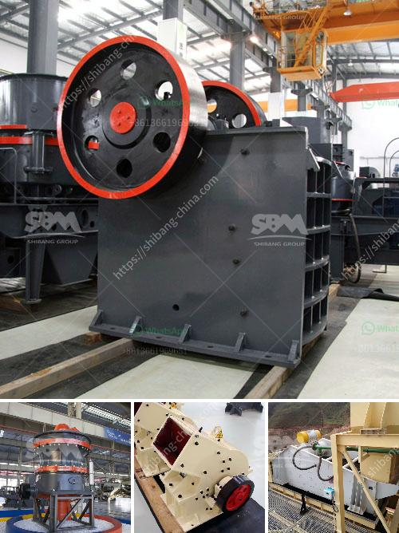

<h3>gold mining equipment plant for sales</h3>
Gold mining has been a popular industry around the world for centuries. With the increasing demand for precious metals, such as gold, the market for mining equipment plant for sales has also risen. These plants are crucial in extracting gold from the earth efficiently and effectively.

Gold mining equipment plants are designed to break down the hard rock ore, extract the desired metals, and discard the waste material. This process is done through various mechanical and chemical processes, involving crushers, screens, concentrators, and smelters.

One of the essential components of a gold mining plant is the crusher. The crusher is responsible for breaking down the oversized rocks into smaller, more manageable pieces. It uses a series of hammers or jaws to crush the rocks, reducing their size for further processing.

After the initial crushing, the crushed material is then passed through screens. These screens allow the smaller-sized rocks and particles to pass through while retaining the larger rocks. This separation helps in sorting out the valuable gold-bearing material from the rest.

Once the valuable material is separated, it is sent to concentrators. Concentrators are devices that use gravity and other physical properties to separate the heavy, gold-bearing particles from the lighter waste material. This process is known as gravity separation, and it is an essential step in the gold extraction process.

Once the gold is concentrated, it is then moved to smelters for further purification. Smelters use high temperatures to melt the gold, separating it from any impurities. This final step ensures that the gold obtained is pure and of high quality.

There are various types of gold mining equipment plants available for sale, depending on the specific needs and requirements of the mining operation. Some plants are designed for high-capacity mining operations, while others are more suitable for small-scale mining projects.

For larger mining operations, a plant with a high-capacity crusher, multiple screens, and advanced concentrators would be ideal. These plants are designed to handle large volumes of ore and extract maximum gold efficiently.

On the other hand, for smaller-scale mining operations, a plant with a smaller crusher, fewer screens, and basic concentrators may suffice. These plants are more cost-effective and easier to set up and maintain.

When considering purchasing a gold mining equipment plant for sale, several factors should be taken into account. The quality and reliability of the equipment are crucial to ensure smooth and uninterrupted operations. It is essential to choose a reputable manufacturer who provides after-sales support and maintenance services.

Additionally, the capacity and efficiency of the plant should match the specific requirements of the mining operation. Assessing the ore grade, expected production volumes, and project timeline will help in determining the appropriate plant capacity.

Furthermore, the purchasing decision should involve calculating the return on investment (ROI). Considering the initial investment, operational costs, and potential revenue from gold sales will help in determining the ROI and the profitability of the mining operation.

In conclusion, gold mining equipment plants play a vital role in the extraction of gold from the earth. These plants are designed to efficiently break down the ore, extract the gold, and purify it. When considering purchasing a plant for sale, factors like quality, capacity, and ROI should be carefully evaluated. With the right equipment, gold mining can be a lucrative and sustainable industry.
<h3>Contact us</h3><ul><li><strong>Whatsapp:&nbsp;<a href="https://wa.me/8613661969651">+8613661969651</a></strong></li><li><a href="https://swt.shibang-china.com/?git&amp;zhl&amp;gold mining equipment plant for sales"><strong>Online Service(chat now)</strong></a></li></ul><h3>Related</h3><ul><li><a href='uses jaw crusher in kenya.md'>uses jaw crusher in kenya</a></li><li><a href='pulverized ball mill in malaysia.md'>pulverized ball mill in malaysia</a></li><li><a href='small mobile limestone crushers.md'>small mobile limestone crushers</a></li><li><a href='hammer mill manufacturer in tamilnadu.md'>hammer mill manufacturer in tamilnadu</a></li><li><a href='jaw crusher suppliers south africa.md'>jaw crusher suppliers south africa</a></li></ul>