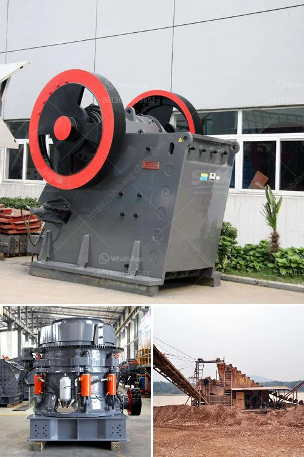

<h3>gold mining equipment south africa for sale</h3>
Gold mining in South Africa has been a prevalent and lucrative industry since the discovery of gold in the late 1800s. It has played a leading role in South Africa's economy, contributing significantly to the country's GDP and employment opportunities. As the demand for gold continues to rise globally, there is a steady rise in the need for gold mining equipment in South Africa. This article will explore the various types of gold mining equipment available in the country and discuss their availability for sale.

One of the popular types of gold mining equipment in South Africa is the gold detector. These devices are capable of detecting gold nuggets and particles embedded in rocks and soils. Gold detectors utilize various technologies such as pulse induction and frequency measurement to detect and discriminate between different types of metals. Some popular gold detectors used in South Africa include the Minelab GPX 5000 and the Garrett AT Gold.

Another essential piece of equipment used in gold mining is the sluice box. A sluice box is a long, narrow channel made of metal or wood, often with riffles or grooves on the bottom. It is used to separate gold particles from other materials such as sand and gravel. The ore is fed into the sluice box, and the water flowing through it washes away lighter materials, leaving behind the heavier gold particles. Sluice boxes come in various sizes and designs, such as the conventional long tom and the modern highbanker.

Dredges are also commonly used in gold mining operations in South Africa. A gold dredge is a floating platform equipped with a suction mechanism called a dredge nozzle. The dredge sucks up gravel and sand from the riverbed or ocean floor and runs it through a sluice box or other gold recovery system. Dredges vary in size, from small portable units to large-scale commercial dredges capable of processing significant amounts of material.

Metal detectors are another crucial piece of equipment used by gold miners. Metal detectors help locate buried gold deposits by detecting the presence of metal in the ground. These detectors can be handheld or mounted on vehicles, and they emit electromagnetic waves that bounce back when they encounter metal objects. In South Africa, metal detectors are commonly used in both placer (riverbed) mining and underground mining operations.

While there is a wide range of gold mining equipment available in South Africa, the availability for sale may vary depending on various factors such as location and demand. However, websites and online platforms dedicated to mining equipment sales often offer a comprehensive selection of equipment for interested buyers. Additionally, local mining supply stores and equipment dealerships may also carry a range of gold mining equipment.

In conclusion, gold mining equipment plays an integral role in the South African mining industry. Gold detectors, sluice boxes, dredges, and metal detectors are just a few examples of the equipment used to extract this precious metal from the earth. While availability for sale may vary, interested buyers can explore online platforms, mining supply stores, and equipment dealerships to find suitable equipment for their gold mining ventures.
<h3>Contact us</h3><ul><li><strong>Whatsapp:&nbsp;<a href="https://wa.me/8613661969651">+8613661969651</a></strong></li><li><a href="https://swt.shibang-china.com/?git&amp;zhl&amp;gold mining equipment south africa for sale"><strong>Online Service(chat now)</strong></a></li></ul><h3>Related</h3><ul><li><a href='used mobile crusher pakistan.md'>used mobile crusher pakistan</a></li><li><a href='jual stone crusher philippines.md'>jual stone crusher philippines</a></li><li><a href='aggregate production process.md'>aggregate production process</a></li><li><a href='river pebble crusher.md'>river pebble crusher</a></li><li><a href='crushing plant for sale in.md'>crushing plant for sale in</a></li></ul>