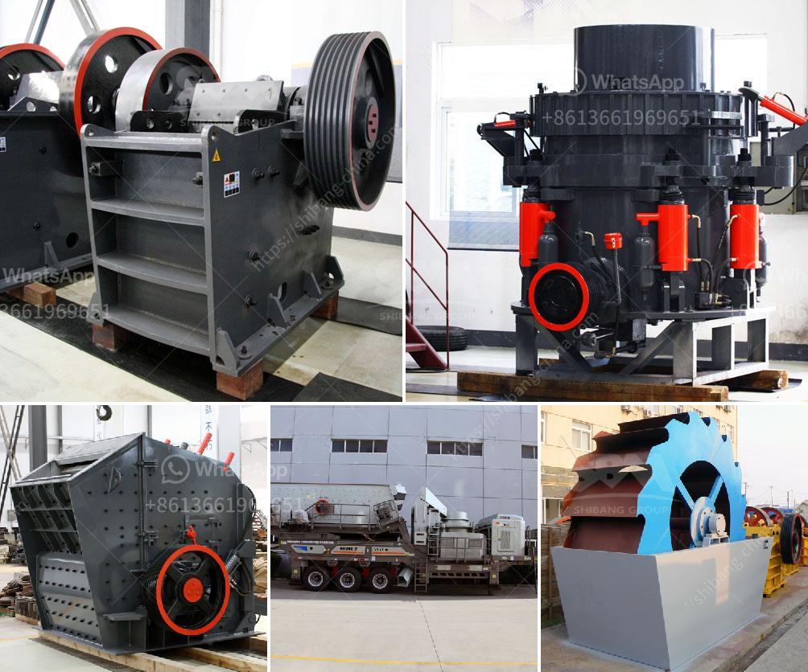

<h3>gold mining equipment stores in tanzania</h3>
Gold mining has been a crucial part of Tanzania's economy for many years. With its vast reserves of gold, the country has attracted miners from around the world seeking to capitalize on this precious metal. However, successful gold mining requires the right equipment to ensure efficient and profitable operations. Thankfully, Tanzania is home to several reputable gold mining equipment stores that cater to the needs of miners.

One such store is located in the bustling city of Dar es Salaam, the economic hub of Tanzania. This store offers a wide range of high-quality gold mining equipment, including crushers, vibrating screens, ball mills, and jigs. They also provide essential tools and accessories like shovels, pickaxes, and gold pans. Additionally, the store offers maintenance and repair services, ensuring that miners can keep their equipment in top-notch condition.

Another reputable gold mining equipment store is situated in Mwanza, a major mining town in Tanzania. This store specializes in providing heavy-duty equipment such as excavators, bulldozers, and trucks. They understand the unique requirements of gold mining operations and stock equipment that can withstand the demanding conditions of the industry. Moreover, they offer comprehensive training programs for miners to ensure the safe and efficient use of the equipment.

These dedicated gold mining equipment stores in Tanzania not only provide high-quality machinery but also offer invaluable expertise to aspiring and experienced miners. Their knowledgeable staff can provide advice on the most suitable equipment for specific mining activities, assisting miners in making informed decisions. Additionally, they stay updated with the latest technological advancements, ensuring that miners have access to cutting-edge equipment.

In conclusion, gold mining equipment stores in Tanzania play a vital role in the success of gold mining operations. They offer a wide range of equipment, tools, and accessories, ensuring that miners have everything they need to extract gold efficiently. With their expertise and commitment to quality, these stores are indispensable for aspiring and experienced miners alike. Whether located in Dar es Salaam, Mwanza, or other mining towns, these stores are a valuable resource for Tanzania's thriving gold mining industry.
<h3>Contact us</h3><ul><li><strong>Whatsapp:&nbsp;<a href="https://wa.me/8613661969651">+8613661969651</a></strong></li><li><a href="https://swt.shibang-china.com/?git&amp;zhl&amp;gold mining equipment stores in tanzania"><strong>Online Service(chat now)</strong></a></li></ul><h3>Related</h3><ul><li><a href='screening equipment mining vibrating screen for sale.md'>screening equipment mining vibrating screen for sale</a></li><li><a href='conveyor belts malaysia.md'>conveyor belts malaysia</a></li><li><a href='gold refining machine capacity 2 tons per day.md'>gold refining machine capacity 2 tons per day</a></li><li><a href='impact crusher mesh.md'>impact crusher mesh</a></li><li><a href='frac sand conveyor price.md'>frac sand conveyor price</a></li></ul>