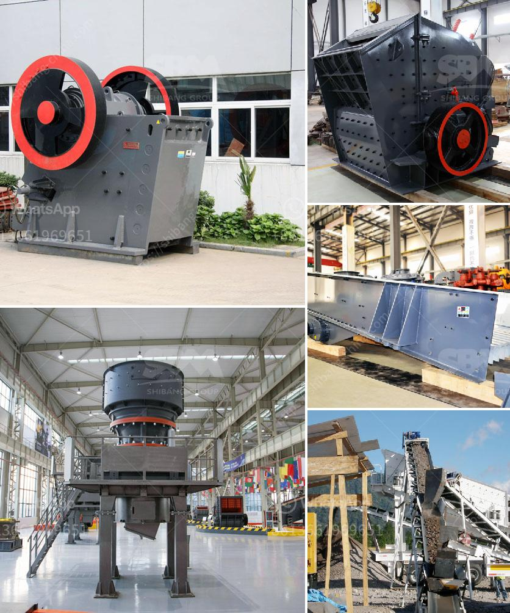

<h3>gold mining project proposal</h3>
Gold mining may be a relatively new type of project proposal in the mining industry, but with the price of this precious metal skyrocketing in recent years, it may be just the right time for eager mining companies to step in. Gold mining is the extraction of gold from underground mines or placer deposits using various techniques. Gold is an extremely valuable commodity and its demand is only rising, making it a promising and potentially profitable venture for those willing to invest.

A gold mining project proposal is a comprehensive plan that showcases the feasibility of a mining operation and highlights the crucial aspects of the project. The proposal outlines the potential mining site, its viability, estimated production capacity, operation costs, financial analysis, and environmental impact. It serves as a comprehensive roadmap for the company to secure financing and permits from relevant authorities.

One of the key factors to consider in a gold mining project proposal is the geology and mineral resources of the mining area. Extensive geological surveys and studies must be conducted to determine the presence and quality of gold deposits. This includes assessing the characteristics of the ore bodies, such as their depth, size, and grade. The proposal should provide an accurate estimation of the available mineral reserves and the expected lifespan of the mining project.

Furthermore, the proposal should outline the mining methods and equipment that will be used in the operation. Gold mining can be conducted through underground or open-pit mining, depending on the characteristics of the deposit. The proposal should detail the chosen mining techniques and explain why they are the most efficient and cost-effective solutions for extracting gold from the deposit.

In terms of financial analysis, the proposal should present a detailed cost-benefit assessment of the project. This includes estimating the initial capital investment, ongoing operational costs, projected revenue, and potential risks. The proposal must demonstrate that the project is financially viable by providing a comprehensive analysis of the anticipated return on investment.

Apart from the financial aspect, the environmental impact of the gold mining project is of utmost importance. The proposal should outline the measures that will be taken to mitigate or minimize any potential negative consequences on the environment. This includes addressing concerns such as habitat disruption, water pollution, and waste management practices. Conservation and restoration plans for the affected areas should also be incorporated in the proposal, demonstrating the commitment of the mining company to responsible and sustainable mining practices.

Lastly, a gold mining project proposal should discuss the social and community aspects of the operation. It should highlight the potential benefits to the local economy, such as job creation and revenue generation. The proposal should also address any potential social conflicts or concerns that may arise from the mining project and outline measures to address them.

In conclusion, a gold mining project proposal is a crucial document for securing financing and permits for a gold mining operation. It should provide a comprehensive analysis of the project's feasibility, financial viability, environmental impact, and social implications. With proper planning, responsible practices, and a favorable market, a gold mining project can be a lucrative venture for mining companies willing to invest in this precious metal.
<h3>Contact us</h3><ul><li><strong>Whatsapp:&nbsp;<a href="https://wa.me/8613661969651">+8613661969651</a></strong></li><li><a href="https://swt.shibang-china.com/?git&amp;zhl&amp;gold mining project proposal"><strong>Online Service(chat now)</strong></a></li></ul><h3>Related</h3><ul><li><a href='ball mill feed spout sale.md'>ball mill feed spout sale</a></li><li><a href='equipment equipments used in gravel crushing.md'>equipment equipments used in gravel crushing</a></li><li><a href='gold hammer mill used forr sale in zimbabwe.md'>gold hammer mill used forr sale in zimbabwe</a></li><li><a href='price conveyor belt.md'>price conveyor belt</a></li><li><a href='portable crushing and screening plant.md'>portable crushing and screening plant</a></li></ul>