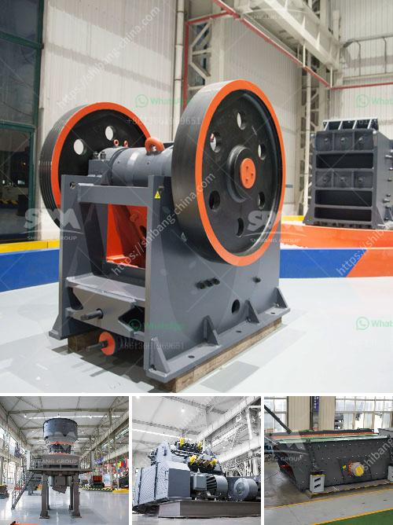

<h3>gold ore processing equipment manufacturer</h3>
Title: A Prominent Gold Ore Processing Equipment Manufacturer Paving the Way for Mining Industry Advancements

Gold mining involves the extraction of valuable gold ores from beneath the earth's surface. A cornerstone of the global mining industry, gold production accounts for approximately 80% of the world's total mining output. Due to its high value and desirability, gold ore requires specialized equipment for efficient extraction and processing. In this article, we shine a spotlight on a leading gold ore processing equipment manufacturer, highlighting their contributions to the mining industry and how they facilitate gold ore processing.

Efficient gold ore processing is crucial in maximizing the economic recovery of gold production. Traditional methods such as gravity concentration, flotation, roasting, and cyanidation are commonly employed to extract gold from its ores. However, technological advancements have revolutionized the mining industry, introducing more effective and environmentally friendly gold ore processing techniques.

As the global demand for gold continues to rise, the need for innovative gold ore processing equipment manufacturers becomes increasingly crucial. Filling this void, renowned mining equipment manufacturer [Company Name] helps gold mining companies effectively extract and process gold ore. With their extensive experience in the industry, they offer cutting-edge equipment to meet the diverse needs of gold mining operations.

[Company Name] prides itself on its vast range of technologically advanced equipment specifically designed for gold ore processing. Let's explore some of their noteworthy offerings:

1. Crushers and Grinding Mills: These equipment are vital in crushing and grinding gold-bearing rocks into smaller particles, facilitating subsequent gold extraction processes.

2. Gravity Concentrators: Utilizing gravity as a distinguishing factor, gravity concentrators separate gold from other minerals, significantly reducing the need for chemical extraction methods.

3. Flotation Machines: These machines enable the separation of valuable minerals from their associated ores, utilizing froth flotation techniques. This process greatly aids in gold concentration.

4. Cyanidation Equipment: Utilizing the well-known cyanide leaching process, this equipment is used to dissolve gold from its ore, effectively extracting the precious metal.

1. Innovative Technology: Their commitment to research and development ensures they stay at the forefront of technological advancements. This allows them to continually improve their equipment to maximize gold ore processing efficiency.

2. Customization Options: Understanding that each gold mining operation has unique requirements, [Company Name] provides equipment that can be customized to specific needs, ensuring optimal performance.

3. After-sales Support: With a global presence, they offer reliable after-sales support services, including equipment maintenance, spare parts supply, and technical assistance.

The demand for gold continues to grow, making efficient gold ore processing crucial for mining companies. [Company Name] serves as a prominent gold ore processing equipment manufacturer, providing technologically advanced equipment specifically designed to enhance the gold extraction and processing processes. Their commitment to innovation, customization, and after-sales support helps mining operations achieve improved efficiency, maximizing the economic recovery of gold production and driving advancements in the mining industry as a whole.
<h3>Contact us</h3><ul><li><strong>Whatsapp:&nbsp;<a href="https://wa.me/8613661969651">+8613661969651</a></strong></li><li><a href="https://swt.shibang-china.com/?git&amp;zhl&amp;gold ore processing equipment manufacturer"><strong>Online Service(chat now)</strong></a></li></ul><h3>Related</h3><ul><li><a href='cost of jaw crusher.md'>cost of jaw crusher</a></li><li><a href='hammer mill for concentrate price.md'>hammer mill for concentrate price</a></li><li><a href='south africa gold processing equipment.md'>south africa gold processing equipment</a></li><li><a href='iron ore wet processing plant.md'>iron ore wet processing plant</a></li><li><a href='gold production process flow chart.md'>gold production process flow chart</a></li></ul>